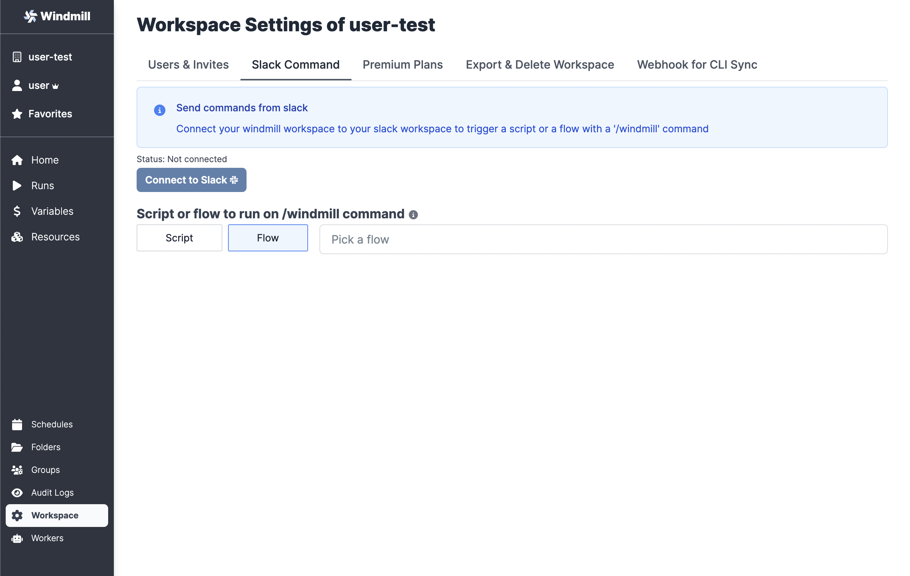
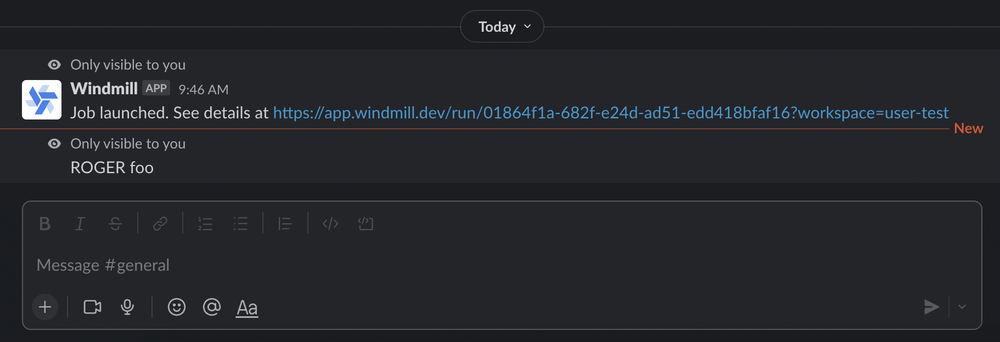
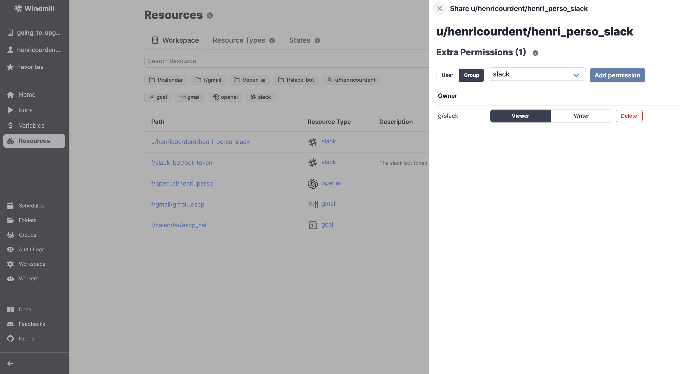
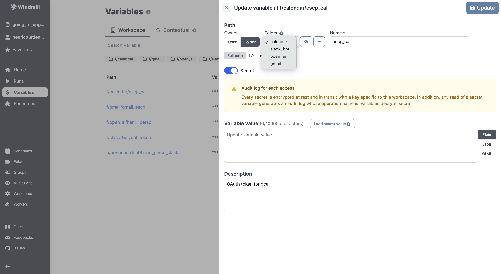
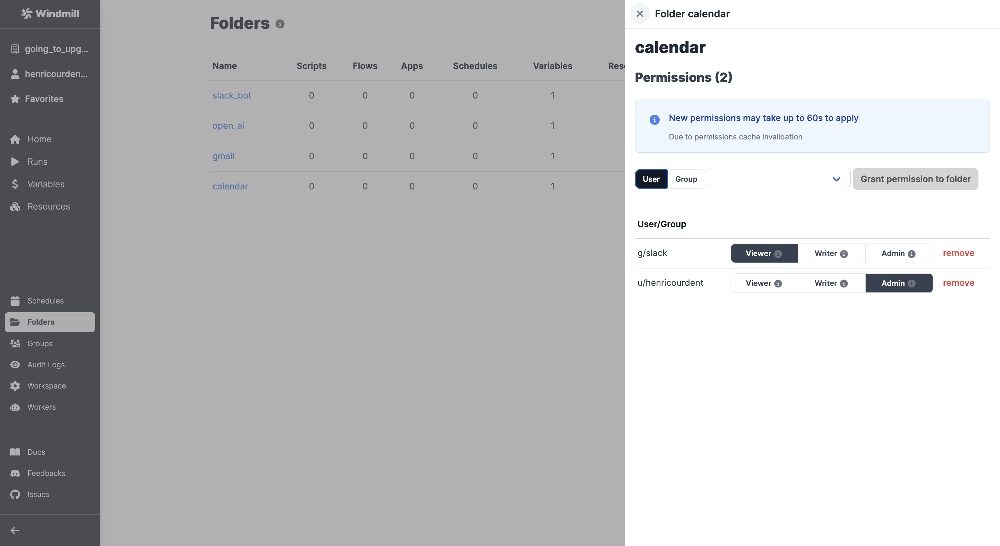
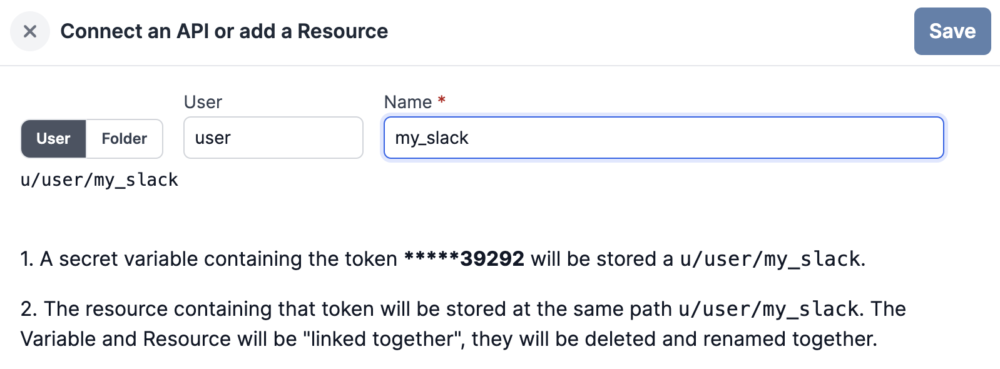
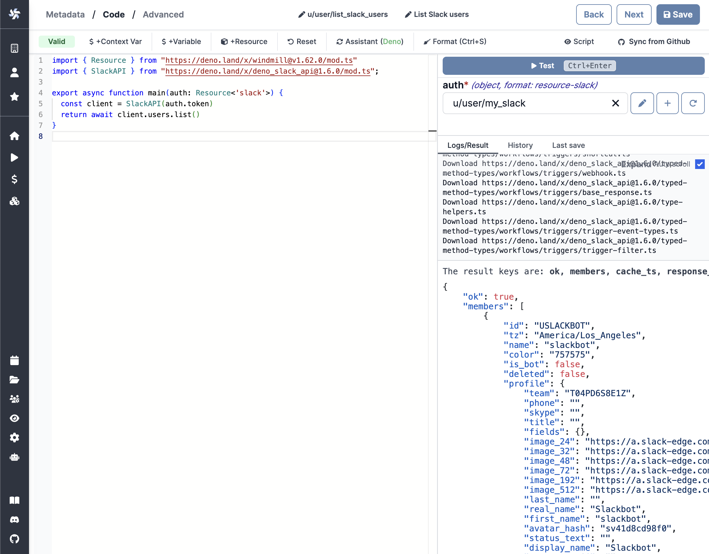

Learn how to integrate Slack with Windmill. There are two ways to build
interactions between the two: run code on Windmill by a Slack command or use the
Slack API directly from Windmill. In this guide, we'll cover both approaches, so
you can find the one that suits you best.

<!--truncate-->


:::info

This guide assumes that you already have a Slack account and a workspace where
you have admin rights. Some experience with Windmill helps, but not required.

:::

## Action on Windmill from Slack

The goal here is to be able to invoke a Windmill Script from Slack, by using
`/windmill` command. First, you need to be a **workspace admin**. Then you
should go to
[workspace settings page](https://app.windmill.dev/workspace_settings) and
select the "Slack Command" tab. On there, click "Connect to Slack".



Slack will ask you to allow Windmill to access your workspace. Click "Allow".

:::info

At the time of writing, Slack cautiones that Windmill is not an approved app. We
are working on getting the app approved but you can safely ignore it for now.

:::


### Using commands on Slack

Once you allow access, you will be redirected to the Slack settings in Windmill.
We'll create a command handler Script first, so let's click "Create a script to
handle slack command".


You will be navigated to the Script editor. Give your script the name
`slack_command_handler`, a short summary of "Slack command handler", leave the
language as `TypeScript` and click "Next". Paste the following code into the
editor and click "Save":

```typescript
export async function main(response_url: string, text: string) {
  await fetch(response_url, {
    method: "POST",
    body: JSON.stringify({ text: `ROGER ${text}` }),
  });
}
```

After the Script is saved, navigate back to the
[Slack settings][wm-slack-settings], choose the "Script" option for adding a
command handler and select your newly created Script.


Congratulations! You've just created a Slack command handler. Now you can use
the `/windmill` command in your Slack workspace to trigger the Script. Try it
out with `/windmill foo` and you should get back `ROGER foo`. Go ahead and
customize the Script to your needs.

:::tip

You can find many pre-made Scripts and Flows on [Windmill Hub][hub-slack] that
are integrating with Slack.

:::



:::info

You can see who ran the `/windmill` command by going to the [Runs page][wm-runs]
on Windmill. The runs will be permissioned through the `g/slack` global group.


:::

:::danger

You won't be able to have Slack interact with your resources and variables before adding them to the `slack` group that was automatically created by Windmill after you set up your Slack workspace on Windmill.

To give the permission, go to "Resources" (and "Variables") menu, click on `Share`, `Group` and pick `slack`.

<br/>



<br/>

One simplier way to handle permissions is to host resources and variables on a folder that is part of the group `slack`.

<br/>



<br/>




:::

## Action on Slack from Windmill

The second way to integrate Slack and Windmill is to allow interaction with
Slack from Windmill. In other words, our goal here is to allow Windmill Scripts
acting on Slack on your behalf.

Lets navigate to the [Resources][wm-resource] page and click "Add a
resource/API".

:::info

You can read more about Resources in the documentation [here][docs-resource].

:::


Select the `slack` Resource Type from the "OAuth APIs" list and by clicking
"Connect", you will be redirected to Slack just like in the
[previous section](#action-on-windmill-from-slack). Click "Allow" to let
Windmill access your Slack workspace. Once that's done, you will be redirected
back to Windmill, where you can name your Slack Resource. Let's leave the
default name `my_slack` and click "Save" in the top right corner.



Let's head to the [Home page][wm-home] and click "+Script" to create a new
Script. Give it the name `list_slack_users`, add the summary "List Slack users"
and click "Next". Paste the following code in the editor and click "Test" - you
should see the list of users and bots in your Slack workspace.

```typescript
import { Resource } from "https://deno.land/x/windmill@v1.62.0/mod.ts";
import { SlackAPI } from "https://deno.land/x/deno_slack_api@1.6.0/mod.ts";

export async function main(auth: Resource<"slack">) {
  const client = SlackAPI(auth.token);
  return await client.users.list();
}
```



:::tip

You can find a more complete version of this Script on
[Windmill Hub][hub-script].

:::

<!-- Links -->

[wm-slack-settings]: https://app.windmill.dev/workspace_settings?tab=slack
[wm-runs]: https://app.windmill.dev/runs
[wm-resource]: https://app.windmill.dev/resources
[wm-home]: https://app.windmill.dev
[hub-slack]: https://hub.windmill.dev/integrations/slack
[hub-script]: https://hub.windmill.dev/scripts/slack/649/list-users-slack
[docs-resource]: https://docs.windmill.dev/docs/core_concepts/resources_and_types
