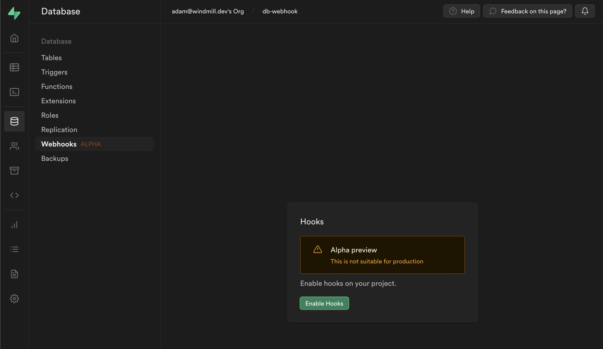
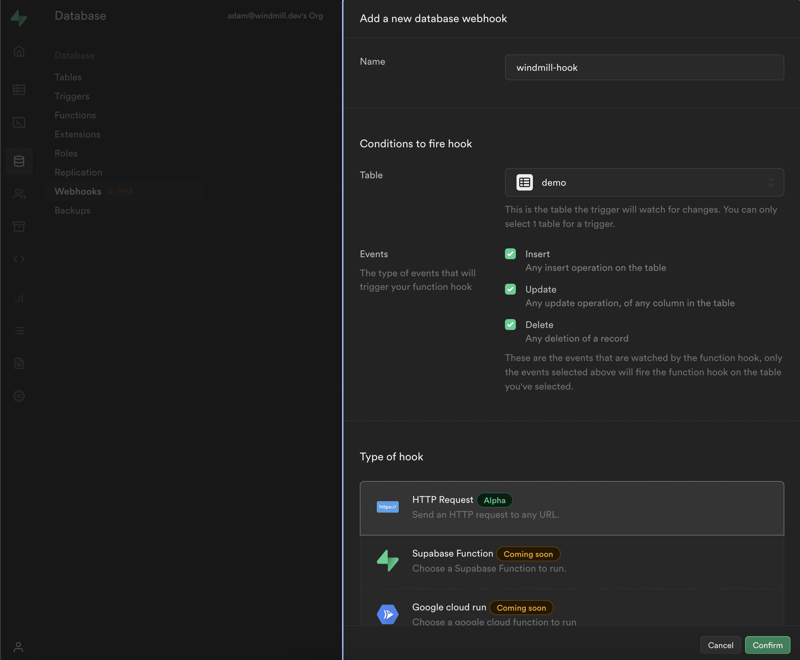
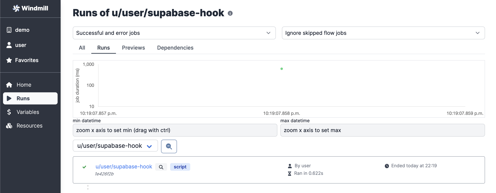

We will see how to build a Windmill workflow that can be triggered by the
[Supabase Database Webhooks](https://supabase.com/docs/guides/database/webhooks).

<!--truncate-->

:::info

This guide assumes that you already have a Supabase project where you have admin
rights. Some experience with [Windmill](/docs/intro) helps, but not required.

:::


:::tip

[Supabase Database Webhooks][supabase-webhook] allow you to send real-time data
from your database to Windmill whenever a table event occurs. You can hook into
three table events: `INSERT`, `UPDATE`, and `DELETE`. All events are fired after
a database row is changed.

:::

We will leverage [Windmill Webhooks][docs-webhook] that allow triggering
Windmill Scripts and Flows via `HTTP POST` requests.

## Create Windmill Script

In order to be able to receive the events from Supabase we need to create a
[Script](/docs/getting_started/scripts_quickstart) that will be triggered by the Supabase webhook. Let's create a simple one, that will just return the event payload.

Navigate to the `Home page` and click "+Script" to create a new Script.
Name it `supabase_hook`, add the summary "Supabase hook" and click "Next". Paste
the following code in the editor and click "Save":

```typescript
export async function main(
  table: string,
  schema: string,
  type: string,
  record: Record<string, any>,
  old_record: Record<string, any>,
) {
  return {
    table,
    schema,
    type,
    record,
    old_record,
  };
}
```

:::info

Supabase will send a payload containing fields exactly the like the arguments of
the `main` function: `table`, `schema`, `type`, `record`, `old_record`.

:::

When the Script is saved, you'll be navigated to the detail page for it. Scroll
down to the "Webhooks" section and click "Create token" - you'll need it to
authenticate requests coming from Supabase.


In the open drawer, click "Create token" once more, enter the label
`supabase-token` and add an expiration date that makes sense for you. Finally,
click "New token" and copy the generated token - make sure you **don't lose
it**.


After you got your token, save the `Path` endpoint of the webhook for the Script
as well. You'll need both to configure the Supabase webhook in the next step.

## Propagate events from Supabase

:::caution

At the time of writing, Supabase Database Webhooks are **NOT** production ready.
Please treat it accordingly.

:::

Go to your Supabase project and select "Database" from the left menu, then click
the "Webhooks" submenu. Click "Enable Hooks", then click "Create Webhook".



Name the webhook `windmill-hook`, select the table you want to emit the events
from, subscribe to `INSERT`, `UPDATE` and `DELETE` events and select the
`HTTP Request` hook type and scroll down for further configuration.



Make sure to select the `POST` HTTP Request method, paste the Script webhook URL
and then add the `Authorization` header with a value like `Bearer <YOUR_TOKEN>`.
Finally, click "Confirm".

:::caution

Notice the `Bearer` keyword and the space before the actual token.

:::


**Congratulations!** Your database events will be propagated from Supabase to
Windmill now.

## Test integration

Let's check if all this works. Navigate to the "SQL Editor" page in your
Supabase project and click "New query" in the top left corner. You will have to
configure your own SQL query because only you know what fields are required in
your database.

:::caution

Make sure that you **insert value in the table that you've setup the webhook
with**.

:::


The `INSERT` event should be propagated to Windmill and trigger the Script. You
can check it on the [Runs](/docs/core_concepts/monitor_past_and_future_runs) page in Windmill. If the Script was indeed
triggered, you should see a result like this:



To see more details about the run, click on the name of it and you'll see the
payload passed to the Script:


Now you know what kind of information is transmitted from Supabase, so feel free
to check how the payload values change on the `UPDATE` and `DELETE` events or
just customize the Script to your needs straight away!

<!-- Links -->

[wm-runs]: https://app.windmill.dev/runs
[supabase-webhook]: https://supabase.com/docs/guides/database/webhooks
[docs-webhook]: /docs/core_concepts/webhooks
