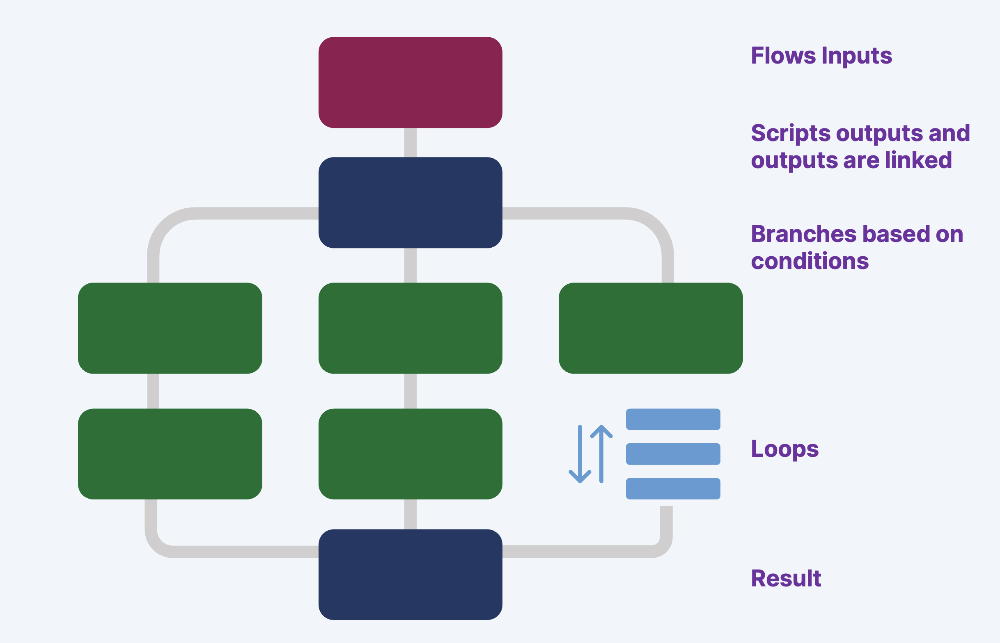
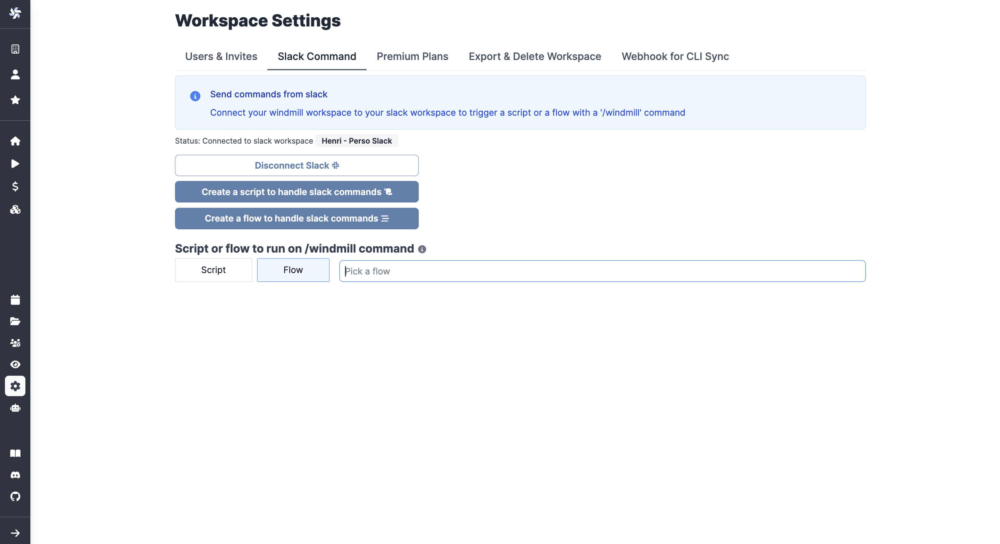
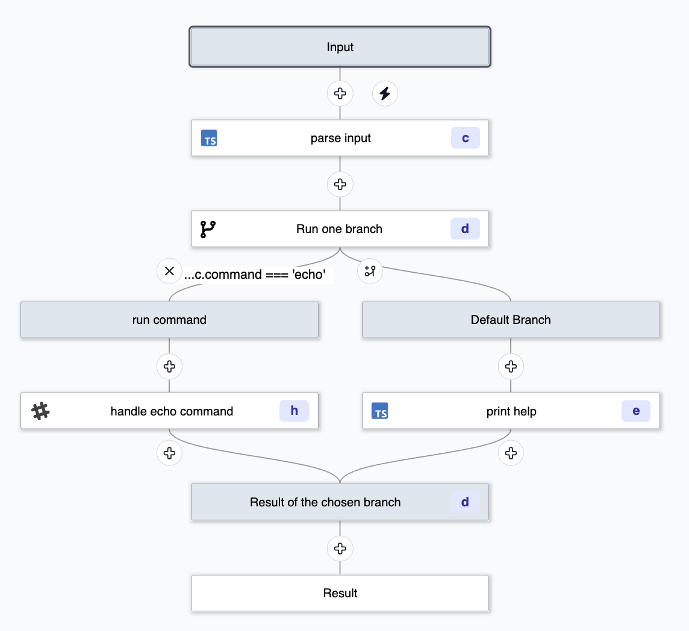
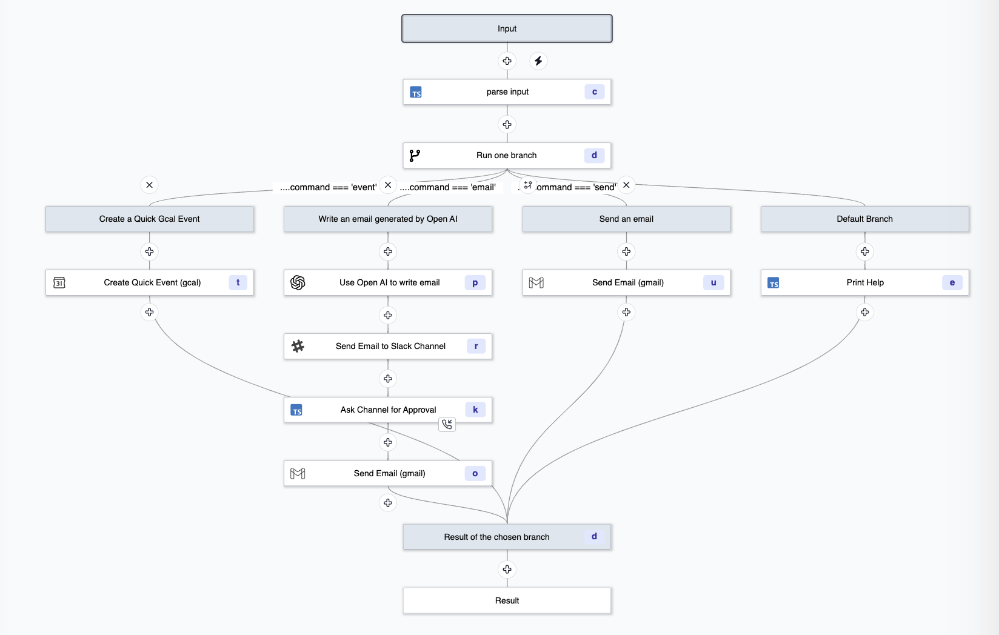

Slackbots are great tools to save time and reduce the need for manual input. They are also useful if you want operational teams to interact with custom-made workflows.

<!--truncate-->

Building a Slack commands handler requires a little bit of Windmill mastering, but it's also a perfect way to get familiar with Windmill, as some key features are used (scripts, worfklows, branches, approval steps).

Also, know that non-technical users can totally build such tools. I'm myself not a developer.

<video
    className="border-2 rounded-xl object-cover w-full h-full"
    autoPlay
    loop
    controls
    id="main-video"
    src="/videos/generated_email.mp4"
    alt="container component"
/>

<br/>

:::tip After this article

You will be able to build a Slackbot from which you can create events on your calendar, send emails and even generate them with Open-AI, all of this from Slack.

:::

<!--If self-hosted-->
<!--If self-hosted/-->

<br/>

We've seen in a [previous article](/docs/integrations/slack) how to connect Slack with Windmill and have briefly explored how to build a first slackbot for a single command (using a script).

Long story short, the first article explained how to connect Slack with Windmill and to create a `/windmill` command on Slack linked to a script hosted on Windmill. Handling several commands on your Slackbot uses just the same logic, but we'll use one single Windmill workflow instead of a script.

[Workflows](/docs/getting_started/flows_quickstart) on Windmill are based on scripts. Workflows are the architecture that allows you to chain scripts with branches, loops etc. while connecting scripts' inputs to previous ouputs.



As we will use only one master workflow to handle all Slack commands, branches will be key: one branch for one Slack command. Let's get started.

## Connecting a first workflow handler to your workspace

Just like the [slack integration tutorial](/docs/integrations/slack), it all starts from your workspace settings. Once you connected Slack to your Windmill account, you will be offered to connect a script or flow to the `/windmill` Slack command. This time, pick "Create a flow to handle Slack commands".



You will get to [this](https://hub.windmill.dev/flows/28/example-handler-for-slack-bot-commands) workflow to handle Slack commands. When linked to the `/windmill` command from the Windmill workspace settings, it will react to it on Slack.

Before going deeper, let's take a look at this first workflow because its logic will be of use.



### Inputs

There are two workflow inputs that are passed to your flow everytime a command is emitted after you have setup the Slack command integration in Windmill:
- **response_url**: this is the url to be used by your flow to respond to the caller using the slack client. It will be automatically completed by the command once you've connected Slack to the Windmill workspace.
- **text**: the text following the `/windmill` command and written on Slack. The following step will make sense of it.

### Text parser

This script is used to dissect the text of the command. In the default example, it creates two variables: "command" and "input". You'll see later that we can play with it and create even more parameters.


```js
export async function main(text_input: string): Output {
  const tokenized: string[] = text_input?.split(' ') || [];
  const command = tokenized[0] || 'help';
  const input = tokenized.slice(1,).join(' ');

  return { command, input };
}

interface Output {
  command: string;
  input: string;
}
```

### Branches

[Branches](/docs/flows/flow_branches) on Windmill are twofold: _Branch all_ and _Branch one_. Here we'll use _Branch one_ as they allow to execute one single branch based on a condition, with also a default branch executed if error.

Although you can theoretically condition branches with any criterium, on your commands handler we'll link them to the output of the parser that set apart the "command" from the Slack input (e.g. `results.c.command === 'echo'`). Here, each branch will match a behavior you expect from the Slackbot.

At last there is a default branch that will execute if issue or no condition fulfilled. By default this script publishes a Help message :

```js
export async function main(response_url: string) {
  await fetch(response_url, {
    method: 'POST',
    body: JSON.stringify({ text: getHelp() }),
  });
}

function getHelp() {
  const help = `Supported commands
  help - prints this command
  echo - prints input
  `;
  return help;
}
```

With this example, you have the keys to build complex Slackbots from Windmill. In the following section, we'll see how to handle more parameters, and use approval steps to go back and forth between Slack and Windmill.

## Enhance your Slackbot with more parameters, resources and approval steps

The goal of the current section is to give you more hints on the potentiality of the Slackbot. Below is a flow that was built for more custom needs. We kept it simple, but we can't even think of all the possibilities of slackbots built with Windmill.

<!--(but maybe our users have more ideas) + link to Atelier post, when published-->



### Fine-tuning the parser to manage longer commands

The default parser of the first example has the advantage of being simple as it parses word by word. Since we want to give more comprehensive parameters (sentences etc.), I chose to manage the parameters following the command separated with `" "` instead of spaces, as shown with the following code (generated with Open AI, remember I'm not a developer):

```js
export async function main(text_input: string): Output {
  let tokenized: string[] = [];
  if (text_input) {
    let start = 0;
    let inString = false;
    for (let i = 0; i < text_input.length; i++) {
      if (text_input[i] === '"') {
        inString = !inString;
      }
      if (text_input[i] === ' ' && !inString) {
        tokenized.push(text_input.slice(start, i).replace(/"/g, ''));
        start = i + 1;
      }
    }
    tokenized.push(text_input.slice(start).replace(/"/g, ''));
  }
  const command = tokenized[0] || 'help';
  const input = tokenized[1];
  const parameters1 = tokenized[2];
  const parameters2 = tokenized[3];

  return { command, input, parameters1, parameters2 };
}
```

With the following parser, if from Slack I write `/windmill coolcommand "the 1st sentence" "the 2nd sentence" "the 3rd sentence"`, it will result in:

```js
{
    "input": "the 1st sentence",
    "command": "coolcommand",
    "parameters1": "the 2nd sentence",
    "parameters2": "the 3rd sentence"
}
```

### Interacting with resources

<video
    className="border-2 rounded-xl object-cover w-full h-full"
    autoPlay
    loop
    controls
    id="main-video"
    src="/videos/command_event.mp4"
    alt="container component"
/>

<br/>

All commands (except the default one) of this slackbot deal with [resources](/docs/core_concepts/resources_and_types). Adding resources is easy on Windmill: many resource types are [already available](https://hub.windmill.dev/resources), or you can [create your own resource type](/docs/core_concepts/resources_and_types#create-a-resource-type).

One specificity of triggering resources from Slack is that **you have to let Windmill know Slack can interact with them**.

You won't be able to have Slack interact with your resources and variables before adding them to the `slack` [group](/docs/core_concepts/groups_and_folders) that was automatically created by Windmill after you set up your Slack workspace on Windmill.

:::tip Allow resources to be triggered from Slack

To give the permission, go to "Resources" (and "Variables") menu, click on `Share`, `Group` and pick `slack`.

<br/>


<br/>

One simplier way to handle permissions is to host resources and variables on a [folder](/docs/core_concepts/groups_and_folders#folders) that is part of the [group](/docs/core_concepts/groups_and_folders#groups) `slack`.

<br/>


<br/>


:::

Once your resources are added, you can choose to pre-load them (as the gcal auth here) or connect them with previous outputs if you want to make them variable depending on the query inputs.


### Human in the loop with approval steps


<video
    className="border-2 rounded-xl object-cover w-full h-full"
    autoPlay
    loop
    controls
    id="main-video"
    src="/videos/generated_email.mp4"
    alt="container component"
/>

<br/>

The example above chains simple scripts to make them into a powerful Slackbot:
- first, it uses [Open AI](https://hub.windmill.dev/scripts/openai/1452/create-completion-openai) to create a completion
- then, it [sends a message to the channel](https://hub.windmill.dev/scripts/slack/1284/send-message-to-channel-slack) where we connected text to the previous completion
- we introduced an [approval step](https://hub.windmill.dev/scripts/slack/1503/ask-channel-for-approval-slack) to stop or go with the flow
- before ending up with a simple [email sending](https://hub.windmill.dev/scripts/gmail/1291/-send-email-gmail)

To make it more convenient, we also introduce the command `/windmill send` to make marginal changes on the Open AI completion and send the email directly to a recipient.

Now you know how to articulate a workflow handler of Slack commands. The potential is unlimited as slackbots can basically behave as a trigger on any of your workflows. Your Slackbot will never be as efficient as the one you built yourself. Start now using the [Hub](https://hub.windmill.dev/) for inspiration, and iterate on our <a href="https://app.windmill.dev/" rel="nofollow">cloud app</a>.