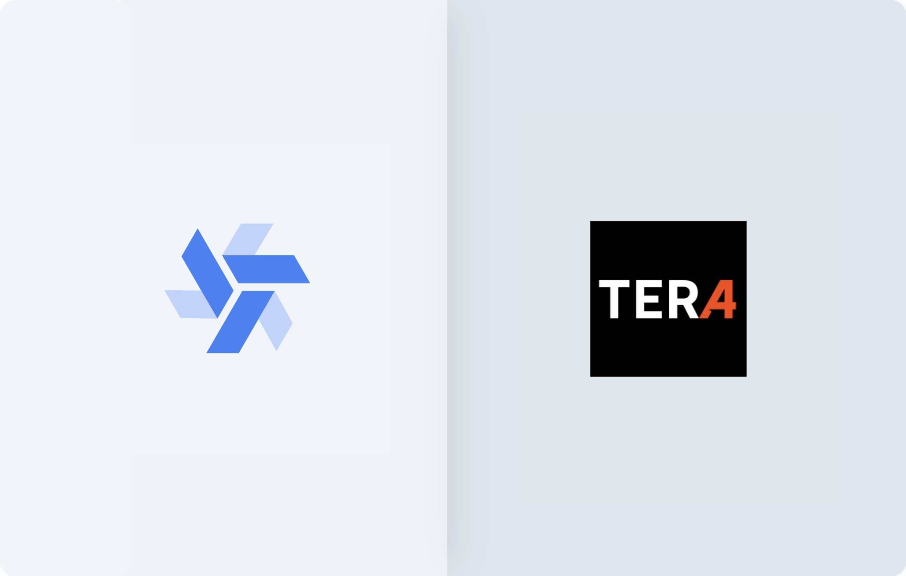
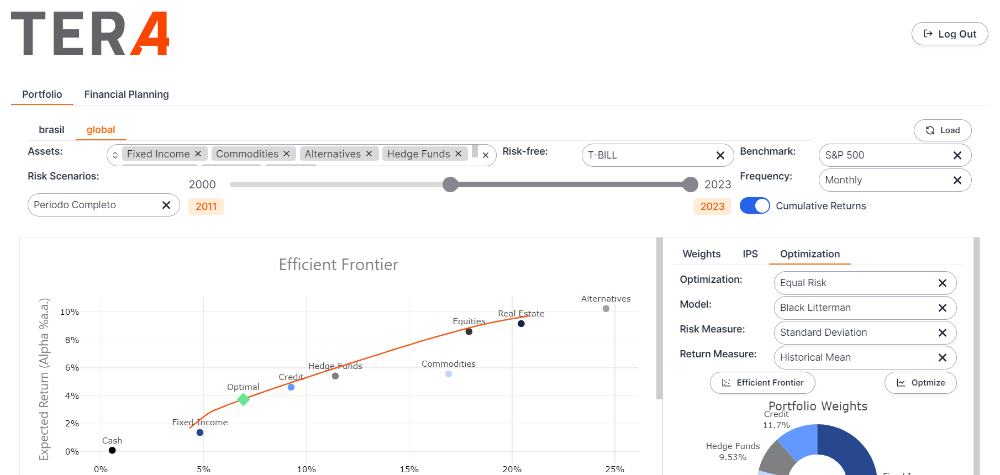

# Windmill for customer-facing Amin Panels - Tera Capital Case Study

> "In general, as clients, we are very satisfied with Windmill. We align with Windmill's mindset of using the littlest code as possible. Everything is well-structured and things do not break."

 

This is a testimonial written by [José Governo](https://www.linkedin.com/in/jose-governo/), Responsible for Data Study and Software Engineering at [Tera Capital](https://www.teracapital.com.br/).

## What before Windmill?

[Tera Capital](https://www.teracapital.com.br/) is a Multi Family Office that offers exclusive asset management and estate planning services.

In the management team, everyone has a specialization in finance, but we lack technical background since I am the first and only member of the team who knows how to code.

To create automations and dashboards for our investment tems and clients, either the team was wasting time creating them themselves, or they would ask me to do it for them, creating a bottleneck.

Therefore, we had three options: either everyone had to become more efficient (not possible overnight), or we had to hire more people (costly), or we had to find a solution so that everyone could focus on their own work.

From a data suite based on manual Excel files, we decided to start over from scratch.

## Why Windmill over Retool?

To begin with, we migrated all our data to [Supabase](https://supabase.com/), which offers a good level of abstraction without the need to master engineering or S3.

Next, we started creating dashboards on this data using <a href="https://retool.com/" rel="nofollow">Retool</a>. However, after a thorough analysis, we decided to switch from Retool to Windmill because:
- Retool is JavaScript-only and does not support Python.
- Retool is limiting in terms of UI capabilities.
- Windmill was much more responsive and quickly installed the components we needed, including critical cold installs such as Bloomberg Open Data.

Within two weeks, everything was set to go with Windmill. Although self-hosting was possible, we opted for the [Cloud Enterprise Edition](/pricing) to avoid maintenance concerns, have our issues addressed within hours, and have our feature requests prioritized.

## How do we work with Windmill?

Today, 6 team members are directly using Windmill. Most of our Windmill's users are non-technical, but they can easily fork an app with our entire [identity in CSS](/docs/apps/app_configuration-settings/app_styling) and [use AI to write code](/docs/core_concepts/ai_generation).

While we initially came to Windmill for its [App Editor](/docs/apps/app_editor), we ended up using [scripts](/docs/script_editor) and [flows](/docs/flows/flow_editor) to make our apps deeper and more complex.

In general, as clients, we are very satisfied with Windmill. We align with Windmill's mindset of using the littlest code as possible. Everything is well-structured and things do not break.

The enterprise services are very helpful. We have a dedicated Discord channel with the Windmill team, who responds very quickly, solves problems within 2 hours, and prioritizes our feature requests. This allows us to focus on our core job and assist our clients.

## Focus on a client-facing app

Among our apps in Windmill, one of the most critical ones is a custom interface for our clients. They simply need to log in any time to https://www.teracapital.com.br/app using Supabase's authentication system to access a personalized, real-time and interactive dashboard of their investments.

Before Windmill, our clients used to receive a monthly PDF with data that was difficult to keep up to date. Now, we have improved our client-facing service without having to subscribe to countless Saas subscriptions.

> Here is an anonymized version of our client-facing dasboard.