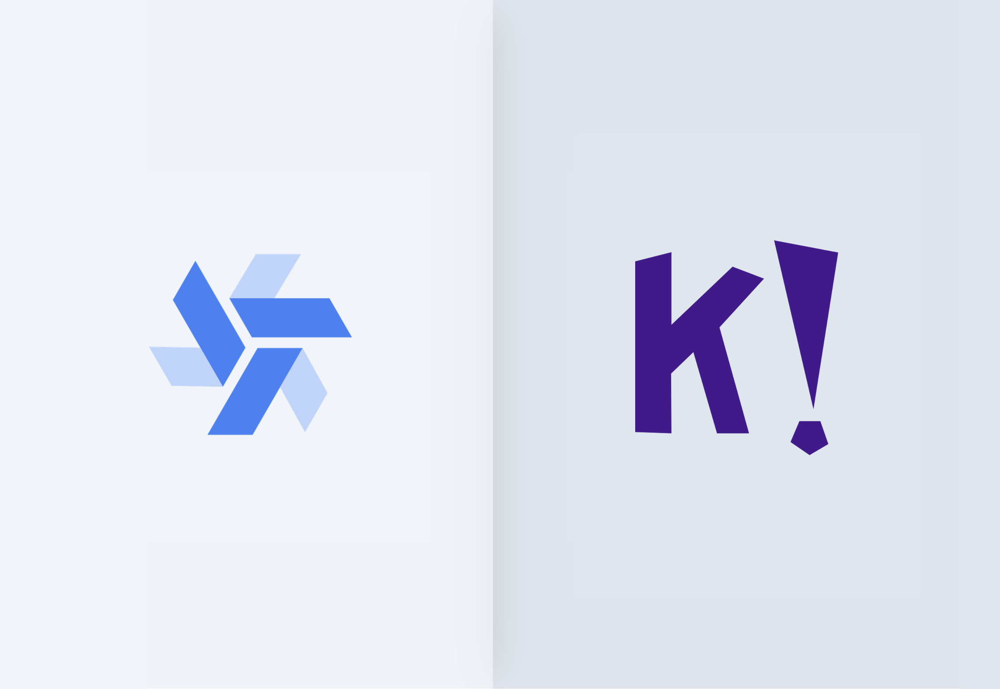

This is a testimonial written by [Sindre Svendby](https://github.com/SindreSvendby), Software Engineer at [Kahoot!](https://kahoot.com/).

<!--truncate-->

 

I have been a software engineer at [Motimate](https://www.motimateapp.com/) for the last 5 years. We are based in Oslo, Norway and we are now part of [Kahoot!](https://kahoot.com/). While the brand Kahoot! traditionnaly focuses on B2C, we target Enterprise clients.

I began working with Windmill at the start of the year. It currently supports internal tools used by multiple departments. We are gradually extending its use to additional departments to better meet their requirements for internal tooling.

## Choosing Windmill for Flexibility

Our team faced some challenges such as constrains on the tech stack. Some tools, such as [Stripe Billing](https://stripe.com/en-fr/billing), prove most effective when your business rules align precisely with their predefined criteria. However, we encountered challenges, including a maximum billing period of one year and the absence of a straightforward method for implementing Consumer Price Index increases. While it's possible to find workarounds, this essentially involves accommodating the limitations. On the other hand, tools like <a href="https://zapier.com/" rel="nofollow">Zapier</a> offer simplicity in their initial use, yet they are more tailored for marketing teams and can become frustrating to iterate upon and build large scale worflows. Easy things are hard (line items -  I'm looking at you), and you do not have the code in [git / version control](/docs/advanced/deploy_gh_gl) systems.

Since we had our own use cases, we needed a flexible solution to create our internal tools.

At first, I turned to Windmill for workflows, as an alternative to Zapier. Windmill made significant improvements in our automation processes. I then discovered the [app builder](/docs/apps/app_editor), which gave us the opportunity to take a lot of our one-off scripts and cli tools that developers run and to fast create a decent UI for our staff to interact with, freeing up time for developers.

Examples of what we have built with Windmill include:
- **Billing**: We integrated [Stripe](https://hub.windmill.dev/integrations/stripe) into an app, replacing Stripe Billing for use cases it is not able to support.
- **Customer success**: As our CS team used [Zendesk](https://www.zendesk.com/), we leveraged Windmill for translating, fetching, and insering articles into Zendesk using [OpenAI](https://hub.windmill.dev/integrations/openai) for new languages ([I shared this flow](https://hub.windmill.dev/flows/47/insert-zendesk-articles-into-supabase-with-openaiembedings) on WindmillHub) and [made an app](#use-case-app-for-translating-zendesk-helpdesk-using-openai) out of it.
<!-- Sindre to add a third use case -->
  
Currently, we use 9 apps, 20 flows, and 63 scripts in our daily operations. They all serve as the foundation for essential tasks, allowing users to independently manage their activities according to their specific needs.

## What's next?

Looking ahead, our plan is to expand Windmill to more use cases.

While I manage the back-office for now, our goal is to engage less-technical team members in building workflows independently. This will be facilitated by leveraging ChatGPT and [Windmill's Code Generation](/docs/core_concepts/ai_generation), coupled with Windmill's rapid [code testing capabilities](/docs/core_concepts/instant_preview), which significantly shortens the feedback loop.

## Use case: App for translating Zendesk Helpdesk using OpenAI

Bellow you will find an internal app that is used by our CS team to translate fetch articles with [OpenAI](/docs/integrations/openai) and insert them into Zendesk with the new language.

<video
	className="border-2 rounded-xl object-cover w-full h-full dark:border-gray-800"
	controls
	id="main-video"
  alt="App for translating Zendesk Helpdesk"
	src="/videos/sindre_app.mp4"
/>