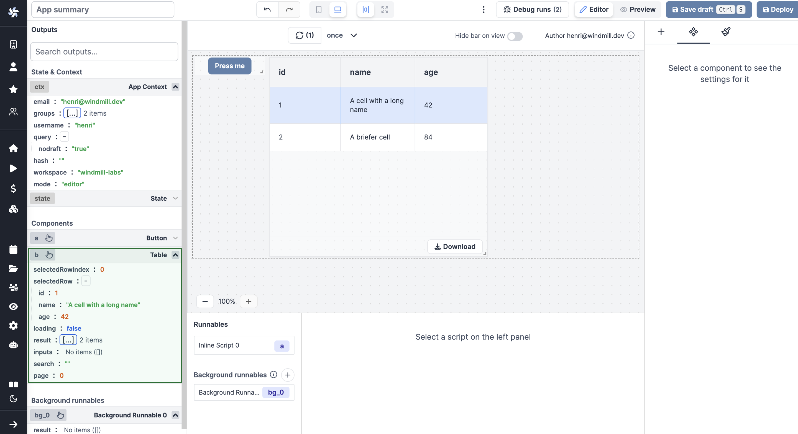

# Outputs

### Component outputs

On the left-hand side of the app editor, you can find the app outputs. Each component has its own outputs. The outputs are displayed in a tree structure. The tree structure is collapsible and can be expanded or collapsed by clicking on the arrow on the left-hand side of the output.

For example, the `Table` component has the following outputs:

- selectedRow: the selected row as an object
- loading: the loading state of the table
- result: the result of the table
- search: the search value of the table
- selectedRowIndex: the selected row index

The outputs are used to quickly visualize the current state of the app.

### Context

In addition to the component outputs, the app context is also displayed. The app context contains the following outputs:

- email: the email of the current user
- username: the username of the current user
- query: the query parameters of the URL

### Connecting inputs

Inputs can be connected to any outputs. When connecting, you can click on the output to connect the input to the output. Note that you can select nested outputs, objects and arrays.
