# Component Library

The app components library is located on the right-hand side of the app editor. It displays the app components and allows you to configure them.

## Components properties

Components can be configured in two ways:

- **Inputs**: inputs can be [connected to an output](../2_outputs.md#connecting-inputs) or computed using a runnable.

  - e.g. `Table` component has an input that can be connected to an output or computed using a runnable, which is an array of objects.
     

- **Configuration**: property such as the button label, the text input placeholder, etc.
  - e.g. `Table` component has a configuration property that allows you to configure the search bar: Client-side search, Server-side search, or no search.

## Component outputs

- **Runnable**: some component can trigger a runnable when an event occurs, usually when a user interacts with the component. The result of the runnable is stored in the component output in the key `result`. It also stores the `loading` state of the component.

  - e.g. `Button` component can trigger a runnable when clicked.
     

- **Own outputs**: some component have outputs defined by the component.
  - e.g. `Table` component has a selectedRow output

## Inserting components

Click on a component in the component library to insert it in the app canvas. It will be automatically positioned to the first available spot starting from the top left corner

## Components list

Windmill provides a set of components that can be used to build apps.

The list of components is constantly growing according to our users' expectations. If you feel like a new component would be useful, please [reach out to us](/docs/misc/getting_help/).

Even though the list of components is never as up to date as on [Windmill Cloud](https://app.windmill.dev/user/login), here is the list of the available components:

### Layout

The layout components are used to organize the components in the app canvas.

- [Container](#container)
- [List](#list)
- [Divider X](#divider-x)
- [Dvider Y](#divider-y)
- [Drawer](#drawer)
- [Vertical Split Panes](#vertical-split-panes)
- [Horizontal Split Panes](#horizontal-split-panes)
- [Modal](#modal-layout)
- [Stepper](#stepper)

### Tabs

- [Tabs](#tabs-2)
- [Conditional Tabs](#conditional-tabs)
- [Sidebar Tabs](#sidebar-tabs)
- [Invisible Tabs](#invisible-tabs)

### Buttons

- [Button](#button)
- [Submit](#submit-form)
- [Modal Form](#modal-form)
- [Download Button](#download-button)

### Inputs

- [Form](#form-input)
- [Text Input](#text-input)
- [Textarea](#textarea)
- [Rich Text Editor](#rich-text-editor)
- [Password](#password-input)
- [Email Input](#email-input)
- [Number](#number-input)
- [Currency](#currency-input)
- [Slider](#slider)
- [Range](#range)
- [Date](#date-input)
- [File Input](#file-input)
- [Toggle](#toggle)
- [Select](#select)
- [Resource Select](#resource-select)
- [MultiSelect](#multiselect)
- [Select Tab](#select-tab)
- [Select Step](#select-step)

### Tables

- [Table](#table)
- [AgGrid Table](#aggrid-table)

### Display

- [Text](#text)
- [Icon](#icon)
- [Image](#image)
- [Map](#map)
- [HTML](#html)
- [PDF](#pdf)
- [Rich Result](#rich-result)
- [Log](#log-display)
- [Flow Status](#flow-status)

### Charts

- [Bar/Line Chart](#barline-chart)
- [Pie Chart](#pie-chart)
- [Vega Lite](#vega-lite)
- [Plotly](#plotly)
- [Scatter Chart](#scatter-chart)
- [Timeseries](#timeseries)
- [ChartJs](#chartjs)

Below you will find details about each component.

## Layout

### Container

Containers allow you to host other components in a box. Moving a container means moving all the components inside.

<video
    className="border-2 rounded-xl object-cover w-full h-full dark:border-gray-800"
    autoPlay
    loop
    controls
    src="/videos/container.mp4"
    alt="container component"
/>
 

To add a component to a container, you can either click on `Insert` while you selected the container,or your can move an existing component by copy/pasting it.

#### Container configuration

The container component has no configuration.

#### Outputs

| Name             |  Type  | Description                     |
| ---------------- | :----: | ------------------------------- |
| selectedTabIndex | number | The number of the selected tab. |

### List

The List component enables duplication of cards or rows with consistent structure, allowing for containment of other components. By default, editing or moving a component will apply changes to all cards or rows, while still allowing customization and exceptions for unique values per component.

<video
    className="border-2 rounded-xl object-cover w-full h-full dark:border-gray-800"
    autoPlay
    controls
    src="/videos/list_component.mp4"
    alt="list component"
/>
 

To add a component to a list, you can either click on `Insert` while you selected the container, or your can move an existing component by copy/pasting it.

Editing or moving a component will apply changes to all cards or rows.

To customize the settings of components within each time, you can use `iter.index` and `iter.value`.

- `iter.index` will retrieve the index number of each card (0, 1, 2 etc.).

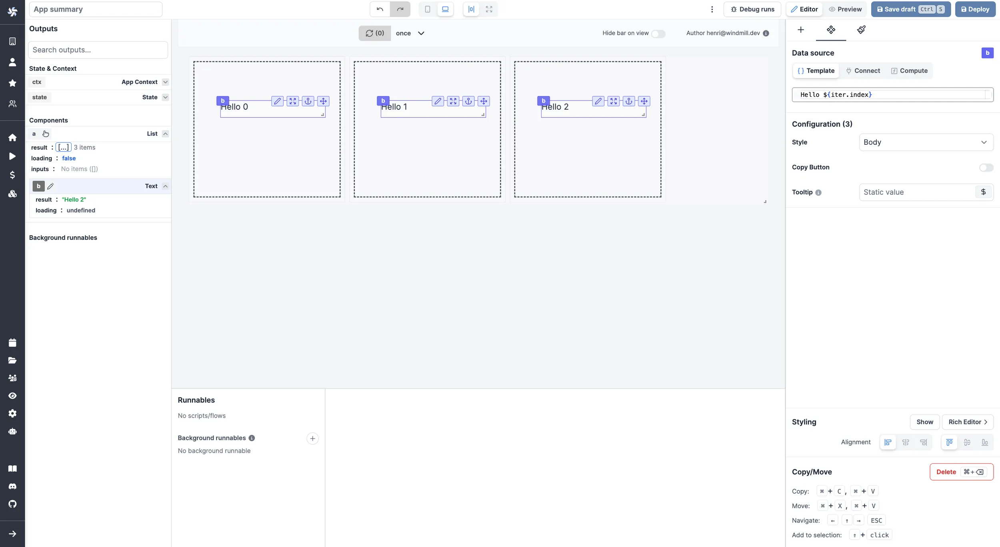

- `iter.value.key` will retrieve the value of each key defined in the `items` section.

<video
    className="border-2 rounded-xl object-cover w-full h-full dark:border-gray-800"
    autoPlay
    controls
    src="/videos/iter.value.mp4"
    alt="iter.value"
/>
 

List components also support having [inputs](#inputs) set inside them. Retrieve the values of each in the `inputs` field of the List component in the [outputs](../2_outputs.md) menu.

<video
    className="border-2 rounded-xl object-cover w-full h-full dark:border-gray-800"
    autoPlay
    controls
    src="/videos/list_inputs.mp4"
    alt="List inputs"
/>
 

#### List configuration

| Name         |  Type  | Connectable | Templatable |    Default     | Description                                  |
| ------------ | :----: | :---------: | :---------: | :------------: | -------------------------------------------- |
| items        | array  |    true     |    false    |    3 items     | The list items.                              |
| item keys    | string |    true     |    false    | `"foo": 1` ... | The keys of each card.                       |
| Width        | string |    false    |    false    |     false      | Wether items should be "Card" of "Full Row". |
| Min Width Px | number |    true     |    true     |      300       | The minimum width in pixels.                 |
| Height Px    | number |    true     |    true     |      280       | The height in pixels.                        |

#### Outputs

| Name    |  Type   | Description                             |
| ------- | :-----: | --------------------------------------- |
| result  |   any   | The result of the list component.       |
| loading | boolean | The loading state of the component.     |
| inputs  |   any   | The [inputs](#inputs) of the component. |

### Divider X

Divider X is a horizontal line.

#### Divider X configuration

| Name  |  Type  | Connectable | Templatable |  Default  | Description                                          |
| ----- | :----: | :---------: | :---------: | :-------: | ---------------------------------------------------- |
| Size  | number |    false    |    false    |     2     | The thickness of the line.                           |
| Color | string |    false    |    false    | #00000060 | The color of the line in hexadecimal color notation. |

### Divider Y

Divider Y is a vertical line.

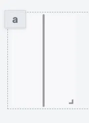

#### Divider Y configuration

| Name  |  Type  | Connectable | Templatable |  Default  | Description                                          |
| ----- | :----: | :---------: | :---------: | :-------: | ---------------------------------------------------- |
| Size  | number |    false    |    false    |     2     | The thickness of the line.                           |
| Color | string |    false    |    false    | #00000060 | The color of the line in hexadecimal color notation. |

### Drawer

The drawer is container called by a button. Once you click on the button, a side tab will appear on which you can display other components.

<video
    className="border-2 rounded-xl object-cover w-full h-full dark:border-gray-800"
    autoPlay
    loop
    controls
    src="/videos/drawer.mp4"
    alt="drawer component"
/>
 

To add a component to a container, you can either click on `Insert` while you selected the opened drawer, or your can move an existing component by copy/pasting it.

#### Drawer configuration

| Name           |                   Type                    | Connectable | Templatable |   Default    | Description                                                               |
| -------------- | :---------------------------------------: | :---------: | :---------: | :----------: | ------------------------------------------------------------------------- |
| No Padding     |                  boolean                  |    false    |    false    |    false     | Whether you want to add extra space between the component and the border. |
| Drawer Title   |                  string                   |    false    |    false    | Drawer title | The title of the container called by Drawer.                              |
| Label          |                  string                   |    true     |    false    |   Press me   | The button label.                                                         |
| Color          | blue, red, dark, light, green, gray, none |    false    |    false    |     blue     | The button color.                                                         |
| Size           |            xs, sm, md , lg, xl            |    false    |    false    |      xs      | The button size.                                                          |
| Fill container |                  boolean                  |    false    |    false    |    false     | Whether the button should fill the container.                             |
| Disabled       |                  boolean                  |    false    |    false    |    false     | Whether the button should be disabled.                                    |

### Vertical Split Panes

Container split in x number of panes vertically.

<video
    className="border-2 rounded-xl object-cover w-full h-full dark:border-gray-800"
    autoPlay
    loop
    controls
    src="/videos/vertical_split.mp4"
    alt="vertical split panes"
/>
 

To add a component to a vertical split pane, you can either click on `Insert` while you selected the vertical split pane, or your can move an existing component by copy/pasting it.

#### Vertical Split Panes configuration

| Name       |  Type   | Connectable | Templatable | Default | Description                                                               |
| ---------- | :-----: | :---------: | :---------: | :-----: | ------------------------------------------------------------------------- |
| No Padding | boolean |    false    |    false    |  false  | Whether you want to add extra space between the component and the border. |

### Horizontal Split Panes

Container split in x number of panes horizontally.

<video
    className="border-2 rounded-xl object-cover w-full h-full dark:border-gray-800"
    autoPlay
    loop
    controls
    src="/videos/horizontal_split.mp4"
    alt="horizontal split panes"
/>
 

To add a component to a horizontal split pane, you can either click on `Insert` while you selected the horizontal split pane, or your can move an existing component by copy/pasting it.

#### Horizontal Split Panes configuration

| Name       |  Type   | Connectable | Templatable | Default | Description                                                               |
| ---------- | :-----: | :---------: | :---------: | :-----: | ------------------------------------------------------------------------- |
| No Padding | boolean |    false    |    false    |  false  | Whether you want to add extra space between the component and the border. |

### Modal

The modal is container called by a button. Once you click on the button, a modal will appear on which you can display other components.

<video
    className="border-2 rounded-xl object-cover w-full h-full dark:border-gray-800"
    autoPlay
    loop
    controls
    id="modal-layout"
    src="/videos/modal-layout.mp4"
    alt="modal component"
/>

#### Modal configuration

| Name                |                   Type                    | Connectable | Templatable |   Default   | Description                                   |
| ------------------- | :---------------------------------------: | :---------: | :---------: | :---------: | --------------------------------------------- |
| modalTitle          |                  string                   |    false    |    false    | Modal title | The title of the modal.                       |
| buttonLabel         |                  string                   |    true     |    false    |  Press me   | The button label.                             |
| buttonColor         | blue, red, dark, light, green, gray, none |    false    |    false    |    blue     | The button color.                             |
| buttonSize          |            xs, sm, md , lg, xl            |    false    |    false    |     xs      | The button size.                              |
| buttonFillContainer |                  boolean                  |    false    |    false    |    false    | Whether the button should fill the container. |
| buttonDisabled      |                  boolean                  |    false    |    false    |    false    | Whether the button should be disabled.        |

### Stepper

The stepper component helps you lay out multi-step apps, with an optional validation function to validate a step.

<video
    className="border-2 rounded-xl object-cover w-full h-full dark:border-gray-800"
    autoPlay
    loop
    controls
    id="modal-layout"
    src="/videos/stepper.mp4"
    alt="stepper"
/>

 

If no validation function is defined, the stepper will behave a tabs component where the user can switch between tabs (with `Previous` and `Next` buttons, or directly on the step).

A validation function can be set and won't allow users to go to the next step while the runnable returns an error.

#### Outputs

| Name             |  Type   | Description                      |
| ---------------- | :-----: | -------------------------------- |
| currentStepIndex | number  | Number of the step / tab.        |
| result           |   any   | The result of the runnable.      |
| loading          | boolean | The loading state of the button. |

## Tabs

### Tabs

Tabs components allow you to host other components in several tabs. Each tab is a container.
Tabs have three display modes:

- `Tabs`: the tabs are displayed horizontally.
- `Sidebar`: the tabs are displayed vertically.
- `Invisible on view`: The tabs are not displayed when the app is viewed. They are only displayed in the app editor. This is useful to make multi-page apps, where each page is a tab.

<video
    className="border-2 rounded-xl object-cover w-full h-full dark:border-gray-800"
    autoPlay
    loop
    controls
    src="/videos/tabs.mp4"
    alt="tabs component"
/>
 

To add a component to a tabs component, you can either click on `Insert` while you selected the tabs component, or your can move an existing component by cutting it and pasting it in the tabs component. See [Moving components](#moving-components).

#### Tabs configuration

| Name      |               Type               | Connectable | Templatable | Default | Description                   |
| --------- | :------------------------------: | :---------: | :---------: | :-----: | ----------------------------- |
| Tabs Kind | Tabs, Sidebar, Invisible on view |    false    |    false    |  Tabs   | The display mode of the tabs. |

### Conditional Tabs

Conditional tabs are tabs that are displayed only if a condition is met. The conditions are an array of conditions. Conditions are evaluated in order. The first condition that evaluates to true will render its subgrid. If no condition evaluates to true, the last subgrid will be rendered.

<video
    className="border-2 rounded-xl object-cover w-full h-full dark:border-gray-800"
    autoPlay
    loop
    controls
    id="conditional-tabs-video"
    src="/videos/conditional-tabs.mp4"
    alt="Conditional tabs component"
/>
 

#### Conditional Tabs configuration

| Name       |   Type    | Connectable | Templatable | Default | Description                            |
| ---------- | :-------: | :---------: | :---------: | :-----: | -------------------------------------- |
| Conditions | boolean[] |    false    |    false    |  false  | The conditions that will be evaluated. |

#### Outputs

| Name                   |   Type    | Description                         |
| ---------------------- | :-------: | ----------------------------------- |
| conditions             | boolean[] | The conditions evalutation          |
| selectedConditionIndex |  number   | The index of the selected condition |

### Sidebar Tabs

The Sidebar Tabs component is basically a [Tabs component](#tabs-2) whose `Tabs Kind` is "Sidebar".

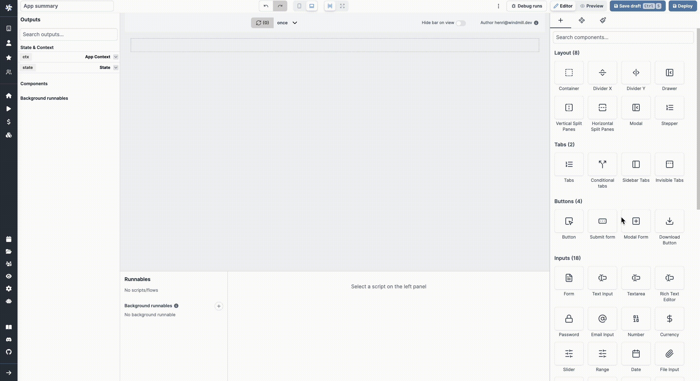

### Invisible Tabs

The Invisible Tabs component is basically a [Tabs component](#tabs-2) whose `Tabs Kind` is "Invisible", meaning the tabs labels are not visible by the user.

## Buttons

### Button

The component triggers a runnable when clicked. If the runnable has parameters, they need to be configured in the component configuration.
The runnable parameters are defined:

- **Static**: the parameter is defined in the component configuration.
- **Connected**: the parameter is connected to an output.

#### Button configuration

| Name                |                Type                 | Connectable | Templatable |  Default  | Description                                                |
| ------------------- | :---------------------------------: | :---------: | :---------: | :-------: | ---------------------------------------------------------- |
| label               |               string                |    true     |    false    | Press me  | The button label.                                          |
| color               | blue, red, dark, light, green, gray |    false    |    false    |   blue    | The button color.                                          |
| size                |         xs, sm, md , lg, xl         |    false    |    false    |    sm     | The button size.                                           |
| Fill container      |               boolean               |    false    |    false    |   false   | Whether the button should fill the container.              |
| disabled            |               boolean               |    false    |    false    |   false   | Whether the button should be disabled.                     |
| Before Icon         |               string                |    false    |    false    | Undefined | The icon to display before the label.                      |
| After Icon          |               string                |    false    |    false    | Undefined | The icon to display after the label.                       |
| Trigger on App load |               boolean               |    false    |    false    |   false   | Whether the button script should be triggered on app load. |

Special parameters:

#### Button On Success

The button component has a special parameter called `On Success`. This parameter is used to trigger one of the following actions:

- **Do nothing**: the button does nothing after the runnable is executed.
- **Go to an URL**: the button redirects the user to the specified URL after the runnable is executed.
- **Set the tab of a Tabs component**: the button sets the tab of a Tabs component after the runnable is executed.
- **Display a toast**: the button displays a toast after the runnable is executed.

##### **Go to an URL configuration:**

| Name    |  Type   | Connectable | Templatable |    Default    | Description                                    |
| ------- | :-----: | :---------: | :---------: | :-----------: | ---------------------------------------------- |
| URL     | string  |    true     |    false    | /apps/get/foo | The URL to redirect the user to.               |
| New Tab | boolean |    false    |    false    |     true      | Whether the URL should be opened in a new tab. |

##### **Set the tab of a Tabs component configuration:**

| Name    |               Type                | Connectable | Templatable | Default | Description                                                                             |
| ------- | :-------------------------------: | :---------: | :---------: | :-----: | --------------------------------------------------------------------------------------- |
| Set Tab | Array<{id: string, index:number}> |    false    |    false    |   []    | The tabs to set. The id is the id of the Tabs component and the index is the tab index. |

##### **Display a toast configuration:**

| Name    |  Type  | Connectable | Templatable |   Default   | Description                          |
| ------- | :----: | :---------: | :---------: | :---------: | ------------------------------------ |
| Message | string |    true     |    false    | Hello there | The message to display in the toast. |

#### Outputs

| Name    |  Type   | Description                      |
| ------- | :-----: | -------------------------------- |
| result  |   any   | The result of the runnable.      |
| loading | boolean | The loading state of the button. |

### Submit Form

The form component allows you to create a form. It has a submit button that triggers a runnable when clicked.
The runnable parameters are defined:

- **Static**: the parameter is defined in the component configuration.
- **User input**: the parameter is defined by the user input.
- **Connected**: the parameter is connected to an output.

Only user inputs are displayed in the form.

#### Form configuration

| Name  |                Type                 | Connectable | Templatable | Default | Description       |
| ----- | :---------------------------------: | :---------: | :---------: | :-----: | ----------------- |
| label |               string                |    true     |    false    | Submit  | The button label. |
| color | blue, red, dark, light, green, gray |    false    |    false    |  dark   | The button color. |
| size  |         xs, sm, md , lg, xl         |    false    |    false    |   sm    | The button size.  |

:::info
The form component has a special parameter called `On Success`. See the button component for more information.
:::

#### Outputs

| Name    |  Type   | Description                      |
| ------- | :-----: | -------------------------------- |
| result  |   any   | The result of the runnable.      |
| loading | boolean | The loading state of the button. |

### Modal Form

The form modal component allows you to create a form. It has a submit button that triggers a runnable when clicked. The form is displayed in a modal, which can be opened by clicking on a button.

The runnable parameters are defined:

- **Static**: the parameter is defined in the component configuration.
- **User input**: the parameter is defined by the user input.
- **Connected**: the parameter is connected to an output.

Only user inputs are displayed in the form in the modal.

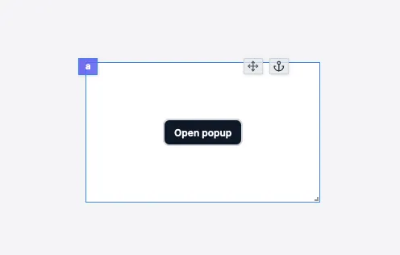
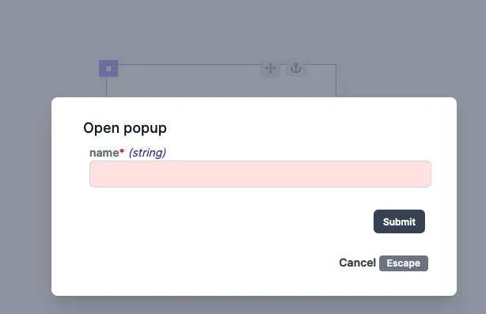

#### Form Modal configuration

| Name  |                Type                 | Connectable | Templatable |  Default   | Description       |
| ----- | :---------------------------------: | :---------: | :---------: | :--------: | ----------------- |
| label |               string                |    true     |    false    | Open popup | The button label. |
| color | blue, red, dark, light, green, gray |    false    |    false    |    dark    | The button color. |
| size  |         xs, sm, md , lg, xl         |    false    |    false    |     sm     | The button size.  |

:::info
The button label is used as the modal title.
:::

:::info
The form modal component has a special parameter called `On Success`. See the button component for more information.
:::

#### Outputs

| Name    |  Type   | Description                      |
| ------- | :-----: | -------------------------------- |
| result  |   any   | The result of the runnable.      |
| loading | boolean | The loading state of the button. |

### Download Button

The download button component allows you to download a file.

<video
    className="border-2 rounded-xl object-cover w-full h-full dark:border-gray-800"
    autoPlay
    controls
    src="/videos/download_button.mp4"
    alt="Download Button"
/>

 

The data source of the Download button must be a data URL scheme with a [Base64 encoded string](../../core_concepts/18_files_binary_data/index.mdx):

<video
    className="border-2 rounded-xl object-cover w-full h-full dark:border-gray-800"
    autoPlay
    controls
    src="/videos/download_base64.mp4"
    alt="Download Button Base64"
/>

#### Download Button configuration

| Name           |                Type                 | Connectable | Templatable |  Default  | Description                                                                                                      |
| -------------- | :---------------------------------: | :---------: | :---------: | :-------: | ---------------------------------------------------------------------------------------------------------------- |
| source         |           string or File            |    true     |    false    |           | The source of the file to download ([Base64 encoded string](../../core_concepts/18_files_binary_data/index.mdx). |
| filename       |               string                |    true     |    false    |           | The name of the file to download.                                                                                |
| label          |               string                |    true     |    false    | Press me  | The button label.                                                                                                |
| color          | blue, red, dark, light, green, gray |    false    |    false    |   blue    | The button color.                                                                                                |
| size           |         xs, sm, md , lg, xl         |    false    |    false    |    sm     | The button size.                                                                                                 |
| Fill container |               boolean               |    false    |    false    |   false   | Whether the button should fill the container.                                                                    |
| disabled       |               boolean               |    false    |    false    |   false   | Whether the button should be disabled.                                                                           |
| Before Icon    |               string                |    false    |    false    | Undefined | The icon to display before the label.                                                                            |
| After Icon     |               string                |    false    |    false    | Undefined | The icon to display after the label.                                                                             |

## Inputs

### Form Input

The form input component allows you to create a form and get answers from the user.

#### Form Input configuration

| Name         |  Type   | Connectable | Templatable | Default | Description                                                                  |
| ------------ | :-----: | :---------: | :---------: | :-----: | ---------------------------------------------------------------------------- |
| Display Type | boolean |    false    |    false    |  false  | This will display the type and/or the format on the field next to the label. |
| Large Gap    | boolean |    false    |    false    |  false  | This will add a large gap between the field elements.                        |

Each argument can be configured (name, description, type, default value, advanced parameters).

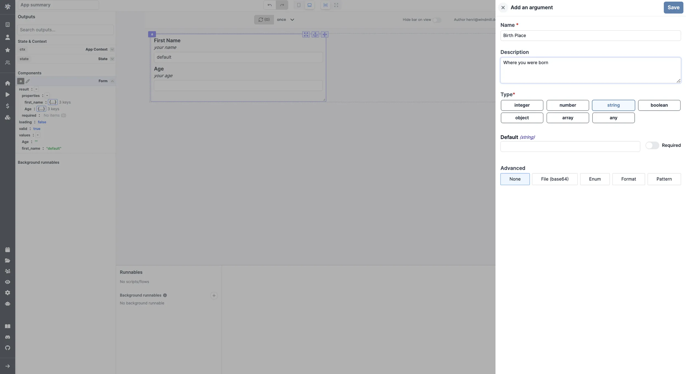

#### Outputs

| Name       |         Type          | Description                                     |
| ---------- | :-------------------: | ----------------------------------------------- |
| properties |        string         | Type, description and default of each argument. |
| loading    |        boolean        | The loading state of the text component.        |
| valid      |        boolean        |                                                 |
| values     | same as each argument | Value of each answer by the user.               |

### Text Input

The text input component allows you to get a string from the user.

#### Text Input configuration

| Name          |  Type  | Connectable | Templatable | Default | Description                          |
| ------------- | :----: | :---------: | :---------: | :-----: | ------------------------------------ |
| Placeholder   | string |    false    |    false    | Type... | The text input placeholder.          |
| Default value | string |    true     |    false    |         | The default value of the text input. |

#### Outputs

| Name   |  Type  | Description           |
| ------ | :----: | --------------------- |
| Result | string | The text input value. |

### Textarea

The textarea component allows you to get a string from the user, with an expandable text area.

#### Textarea configuration

| Name          |  Type  | Connectable | Templatable | Default | Description                          |
| ------------- | :----: | :---------: | :---------: | :-----: | ------------------------------------ |
| Placeholder   | string |    false    |    false    | Type... | The text input placeholder.          |
| Default value | string |    true     |    false    |         | The default value of the text input. |

#### Outputs

| Name   |  Type  | Description           |
| ------ | :----: | --------------------- |
| Result | string | The text input value. |

### Rich Text Editor

The Rich Text Editor component allows to have to user enter text with a layout, on top of files or videos.

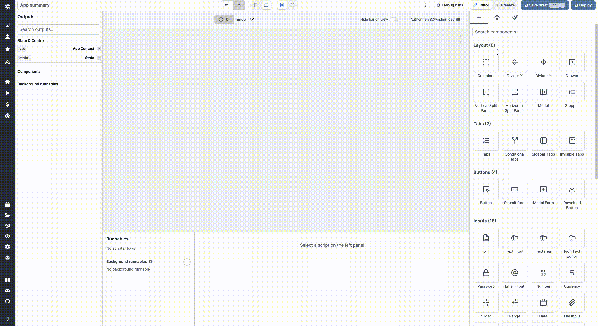

#### Rich Text Editor configuration

| Name          |  Type  | Connectable | Templatable | Default | Description                          |
| ------------- | :----: | :---------: | :---------: | :-----: | ------------------------------------ |
| Placeholder   | string |    false    |    false    | Type... | The text input placeholder.          |
| Default value | string |    true     |    false    |         | The default value of the text input. |

#### Outputs

| Name   |  Type  | Description                                                                          |
| ------ | :----: | ------------------------------------------------------------------------------------ |
| Result | string | The Rich Text Editor input value, in HTML-like syntax within the Quill delta format. |

### Password Input

The password input component allows you to get a password from the user.

#### Password Input configuration

| Name        |  Type  | Connectable | Templatable | Default  | Description                     |
| ----------- | :----: | :---------: | :---------: | :------: | ------------------------------- |
| Placeholder | string |    false    |    false    | Password | The password input placeholder. |

#### Outputs

| Name   |  Type  | Description               |
| ------ | :----: | ------------------------- |
| Result | string | The password input value. |

### Email Input

The email input component allows you to get an email from the user.

#### Email Input configuration

| Name          |  Type  | Connectable | Templatable | Default | Description                    |
| ------------- | :----: | :---------: | :---------: | :-----: | ------------------------------ |
| Placeholder   | string |    false    |    false    |  Email  | The email input placeholder.   |
| Default value | string |    true     |    false    |  Email  | The email input default value. |

#### Outputs

| Name   |  Type  | Description            |
| ------ | :----: | ---------------------- |
| Result | string | The email input value. |

### Number Input

The number input component allows you to get a number from the user.

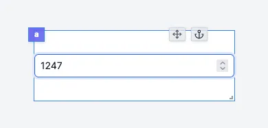

#### Number Input configuration

| Name          |  Type  | Connectable | Templatable | Default | Description                            |
| ------------- | :----: | :---------: | :---------: | :-----: | -------------------------------------- |
| placeholder   | string |    false    |    false    | Type... | The number input placeholder.          |
| default value | number |    true     |    false    |         | The default value of the number input. |

#### Outputs

| Name   |  Type  | Description            |
| ------ | :----: | ---------------------- |
| result | number | The number input value |

### Currency Input

The currency input component allows you to get a written amount of money in a set currency from the user.

#### Currency Input configuration

| Name                |                                     Type                                     | Connectable | Templatable | Default | Description                              |
| ------------------- | :--------------------------------------------------------------------------: | :---------: | :---------: | :-----: | ---------------------------------------- |
| default value       |                                    number                                    |    true     |    false    |    /    | The default value of the currency input. |
| is negative allowed |                                   boolean                                    |    false    |    false    |  false  | If negative amounts will be accepted.    |
| currency            |             string: USD, EUR, GBP, CAD, AUD, JPY, CNY, INR, BRL              |    false    |    false    |   USD   | The default value of the currency input. |
| locale              | string: en-US, en-GB, en-IE, de-DE, fr-FR, br-FR, ja-JP, pt-TL, fr-CA, en-CA |    false    |    false    |  en-US  | The format of the amount.                |

#### Outputs

| Name   |  Type  | Description              |
| ------ | :----: | ------------------------ |
| result | number | The currency input value |

### Slider

The slider component allows you to get a number from the user.

#### Slider configuration

| Name |  Type  | Connectable | Templatable | Default | Description                      |
| ---- | :----: | :---------: | :---------: | :-----: | -------------------------------- |
| min  | number |    false    |    false    |    0    | The minimum value of the slider. |
| max  | number |    false    |    false    |   42    | The maximum value of the slider. |

#### Outputs

| Name   |  Type  | Description       |
| ------ | :----: | ----------------- |
| result | number | The slider value. |

### Range

The slider component allows you to get a range of numbers from the user.

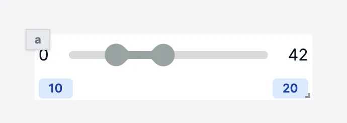

#### Range configuration

| Name |  Type  | Connectable | Templatable | Default | Description                     |
| ---- | :----: | :---------: | :---------: | :-----: | ------------------------------- |
| min  | number |    false    |    false    |    0    | The minimum value of the range. |
| max  | number |    false    |    false    |   42    | The maximum value of the range. |

#### Outputs

| Name     |  Type  | Description             |
| -------- | :----: | ----------------------- |
| result 0 | number | The range bottom value. |
| result 1 | number | The range top value.    |

### Date Input

The date input component allows you to get a date from the user.

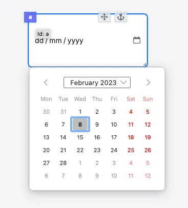

#### Date Input configuration

| Name          |  Type  | Connectable | Templatable | Default | Description                          |
| ------------- | :----: | :---------: | :---------: | :-----: | ------------------------------------ |
| minDate       | string |    true     |    false    |         | The minimum date of the date input.  |
| maxDate       | string |    true     |    false    |         | The maximum date of the date input.  |
| default value | string |    true     |    false    |         | The default value of the date input. |

#### Outputs

| Name   |  Type  | Description           |
| ------ | :----: | --------------------- |
| result | string | The date input value. |

### File Input

The file input allows users to drop files into the app.

Files uploaded are converted and returned as a data URL scheme with a [Base64 encoded string](../../core_concepts/18_files_binary_data/index.mdx).

#### File Input configuration

| Name                |  Type   | Connectable | Templatable |                   Default                   | Description                                                    |
| ------------------- | :-----: | :---------: | :---------: | :-----------------------------------------: | -------------------------------------------------------------- |
| Accepted File Types |  array  |    false    |    false    |       "image/\*" ; "application/pdf"        | The types of files you accept to be submitted.                 |
| Allow Multiple      | boolean |    false    |    false    |                    false                    | If allowed, the user will be able to select more than one file |
| Text                | string  |    false    |    false    | Drag and drop files or click to select them | The text displayed on the file input.                          |

#### Outputs

| Name   |  Type  | Description                  |
| ------ | :----: | ---------------------------- |
| result | string | The name of the loaded file. |

### Toggle

The toggle component allows you to get a boolean from the user.

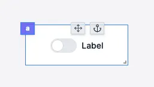

#### Toggle configuration

| Name          |  Type   | Connectable | Templatable | Default | Description                      |
| ------------- | :-----: | :---------: | :---------: | :-----: | -------------------------------- |
| label         | string  |    true     |    false    |  Label  | The toggle label.                |
| default value | boolean |    true     |    false    |         | The default value of the toggle. |

#### Outputs

| Name   |  Type   | Description              |
| ------ | :-----: | ------------------------ |
| result | boolean | The state of the toggle. |

### Select

The select component allows you to get a string from the user.

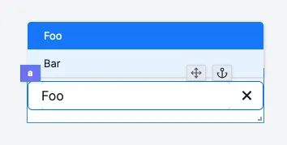

#### Select configuration

| Name          |  Type   | Connectable | Templatable | Default | Description                     |
| ------------- | :-----: | :---------: | :---------: | :-----: | ------------------------------- |
| items         |  Array  |    true     |    false    |         | The select items.               |
| item key      | string  |    true     |    false    |         | The key of the item to display. |
| create        | boolean |    false    |    false    |  false  | If users can create values.     |
| default value | boolean |    true     |    false    |         | The default value of the input. |

#### Outputs

| Name   |  Type  | Description        |
| ------ | :----: | ------------------ |
| result | string | The selected item. |

### Resource Select

The Resource Select component allows you to have users pick [resources](../../core_concepts/3_resources_and_types/index.mdx) from your Windmil workspace to interact with [intergrations](../../integrations/0_integrations_on_windmill.mdx).

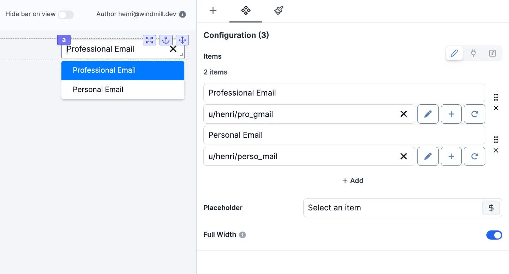

#### Resource Select configuration

| Name        |                               Type                                | Connectable | Templatable | Default | Description                                                     |
| ----------- | :---------------------------------------------------------------: | :---------: | :---------: | :-----: | --------------------------------------------------------------- |
| Items Name  |                              string                               |    true     |    false    |  "bar"  | The name of each suggested resource.                            |
| Items       |  [resource](../../core_concepts/3_resources_and_types/index.mdx)  |    true     |    false    |         | The Windmill resource.                                          |
| Placeholder | [variable](../../core_concepts/2_variables_and_secrets/index.mdx) |    false    |    false    |         | The variable that will be displayed by default.                 |
| Full Width  |                              boolean                              |    false    |    false    |  true   | Set the width of the options popup to 100% of the select width. |

#### Outputs

| Name   |  Type  | Description                                |
| ------ | :----: | ------------------------------------------ |
| result | string | The selected resource (in `$res:` format). |

### Multiselect

The multiselect component allows you to get multiple strings from the user.

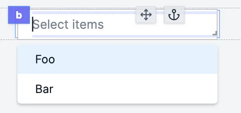

#### Multiselect configuration

| Name        |  Type  | Connectable | Templatable |    Default    | Description                                 |
| ----------- | :----: | :---------: | :---------: | :-----------: | ------------------------------------------- |
| items       | string |    true     |    false    | "Foo" ; "Bar" | The select items.                           |
| placeholder | string |    true     |    false    | Select items  | The text that will be displayed by default. |

#### Outputs

| Name   |  Type  | Description         |
| ------ | :----: | ------------------- |
| result | string | The selected items. |

### Select Tab

The Select Tab is standalone tab component that behaves like a select component. It is meant to have the chosen tab to be chosen as input by components or runnables.

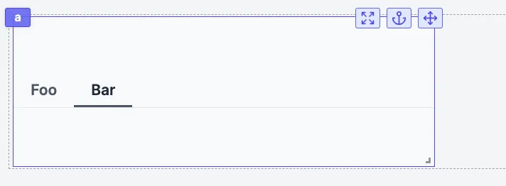

#### Select Tab configuration

| Name          |  Type  | Connectable | Templatable |    Default    | Description                                       |
| ------------- | :----: | :---------: | :---------: | :-----------: | ------------------------------------------------- |
| Items         | string |    true     |    false    | "Foo" ; "Bar" | The select tabs items (label and value, in JSON). |
| Default Value | string |    true     |    false    |               | The default value of the tabs labels and value.   |

#### Outputs

| Name   |  Type  | Description       |
| ------ | :----: | ----------------- |
| result | string | The selected tab. |

### Select Step

The Select Step is standalone tab component that behaves like a select component. It is meant to have the chosen tab to be chosen as input by components or runnables.

#### Select Step configuration

| Name          |  Type  | Connectable | Templatable |    Default    | Description                                       |
| ------------- | :----: | :---------: | :---------: | :-----------: | ------------------------------------------------- |
| Items         | string |    true     |    false    | "Foo" ; "Bar" | The select step items (label and value, in JSON). |
| Default Value | string |    true     |    false    |               | The default value of the step labels and value.   |

#### Outputs

| Name   |  Type  | Description        |
| ------ | :----: | ------------------ |
| result | string | The selected step. |

## Tables

### Table

The table component allows you to display a table.

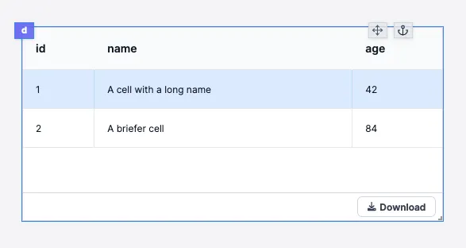

#### Table Input

|      Type       | Connectable | Templatable | Default | Description     |
| :-------------: | :---------: | :---------: | :-----: | --------------- |
| `Array<Object>` |    true     |    false    |         | The table data. |

:::info
The columns are automatically generated from all the keys of the objects in the array.
:::

#### Table configuration

| Name   |                   Type                    | Connectable | Templatable |  Default   | Description                           |
| ------ | :---------------------------------------: | :---------: | :---------: | :--------: | ------------------------------------- |
| search | 'Disabled', 'By Runnable', 'By component' |    false    |    false    | 'Disabled' | The search query to filter the table. |

Search can be configured in the following ways:

- **Disabled**: The search is disabled.
- **By Runnable**: The search is done in the backend.
- **By component**: The search is done in the frontend.

#### Table actions

`Table` can define actions that will be displayed in each row of the table. An action is a `Button` component that cannot be moved.

#### Outputs

| Name             |  Type   | Description                              |
| ---------------- | :-----: | ---------------------------------------- |
| result           | Object  | The table data.                          |
| loading          | boolean | The loading state of the table component |
| selectedRow      | Object  | The selected row                         |
| selectedRowIndex | number  | The selected row index                   |
| search           | string  | The search query                         |

### AgGrid Table

:::tip Guide
If you are new to Ag Grid, check out our [Introduction guide](../../misc/9_guides/aggrid_table/index.md).
:::

The AgGrid table component allows you to display an agnostic grid table.

<video
    className="border-2 rounded-xl object-cover w-full h-full dark:border-gray-800"
    autoPlay
    loop
    controls
    src="/videos/aggrid_table.mp4"
    alt="aggrid table"
/>
 

#### AgGird Table Input

|      Type       | Connectable | Templatable | Default | Description     |
| :-------------: | :---------: | :---------: | :-----: | --------------- |
| `Array<Object>` |    true     |    false    |         | The table data. |

#### AgGrid Table configuration

| Name                       |  Type   | Connectable | Templatable |    Default    | Description                                                                                                     |
| -------------------------- | :-----: | :---------: | :---------: | :-----------: | --------------------------------------------------------------------------------------------------------------- |
| Column Defs                | object  |    true     |    false    | Id, Name, Age | The definition of the columns & their name.                                                                     |
| Flex                       | boolean |    false    |    false    |     true      | Allows you to distribute available space among multiple elements to control their relative sizes and positions. |
| All Editable               | boolean |    false    |    false    |     false     | Whether you want all columns to be editable.                                                                    |
| Multiple Selectable        | boolean |    false    |    false    |     false     | Make multiple rows selectable at once.                                                                          |
| Row Multiselect With Click | boolean |    false    |    false    |     true      | If multiple selectable, allow multiselect with click.                                                           |
| Pagination                 | boolean |    false    |    false    |     false     | Whether you want pages on your table.                                                                           |

#### Outputs

| Name             |  Type   | Description                                     |
| ---------------- | :-----: | ----------------------------------------------- |
| result           | Object  | The AgGrid table data.                          |
| loading          | boolean | The loading state of the AgGrid table component |
| selectedRow      | Object  | The selected row                                |
| selectedRowIndex | number  | The selected row index                          |

## Display

### Text

The text component allows you to display text.

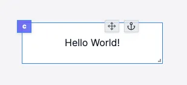

#### Text Input

|  Type  | Connectable | Templatable |   Default    | Description          |
| :----: | :---------: | :---------: | :----------: | -------------------- |
| string |    true     |    true     | Hello World! | The text to display. |

#### Text configuration

| Name        |                      Type                      | Connectable | Templatable | Default | Description                                                     |
| ----------- | :--------------------------------------------: | :---------: | :---------: | :-----: | --------------------------------------------------------------- |
| style       | 'title', 'subtitle', 'body', 'label','caption' |    false    |    false    | 'body'  | The text style.                                                 |
| Extra Style |                     string                     |    false    |    false    |         | Extra style to apply to the text: CSS rules like "color: blue;" |

#### Outputs

| Name    |  Type   | Description                              |
| ------- | :-----: | ---------------------------------------- |
| result  | string  | The text.                                |
| loading | boolean | The loading state of the text component. |

#### Inline editor

You can directly edit the text by click the `Pen` icon on the app editor. You can also double click on the text to edit it.

<video
    className="border-2 rounded-xl object-cover w-full h-full dark:border-gray-800"
    autoPlay
    loop
    controls
    src="/videos/text_editor.mp4"
/>

### Icon

The Icon API allows you to display an icon chosen in a library of icons.

#### Icon configuration

| Name         |  Type  | Connectable | Templatable |   Default    | Description                   |
| ------------ | :----: | :---------: | :---------: | :----------: | ----------------------------- |
| Icon         | string |    true     |    false    |    Smile     | The actual icon.              |
| Color        | string |    true     |    false    | currentColor | The color of the icon.        |
| Size         | number |    false    |    false    |      24      | The size of the icon.         |
| Stroke Width | number |    false    |    false    |      2       | The width of the icon stroke. |

### Image

The Image component allows you to display a picture.

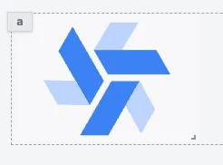

#### Image configuration

| Name      |             Type             | Connectable | Templatable |  Default  | Description                                                        |
| --------- | :--------------------------: | :---------: | :---------: | :-------: | ------------------------------------------------------------------ |
| Source    |            string            |    true     |    false    | /logo.svg | The image.                                                         |
| Image Fit | string: contain, cover, fill |    false    |    false    |  contain  | How the image will fit the component box.                          |
| Alt text  |            string            |    false    |    false    |     /     | This text will appear if the image can't be loaded for any reason. |

#### Outputs

| Name    |  Type   | Description                               |
| ------- | :-----: | ----------------------------------------- |
| loading | boolean | The loading state of the Image component. |

### Map

The Map component allows you to display an interactive map.

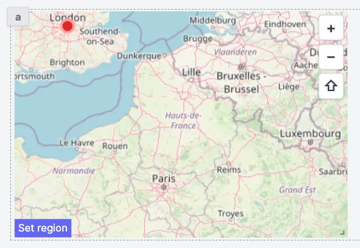

#### Map configuration

| Name      |  Type  | Connectable | Templatable | Default | Description                             |
| --------- | :----: | :---------: | :---------: | :-----: | --------------------------------------- |
| Longitude | number |    true     |    false    |   15    | The longitude of the center of the map. |
| Latitude  | number |    true     |    false    |   50    | The latitude of the center of the map.  |
| Zoom      | number |    true     |    false    |    3    | The zoom of the map.                    |
| Markers   | object |    true     |    false    |         | The map data.                           |

#### Outputs

| Name                   |  Type  | Description                                                 |
| ---------------------- | :----: | ----------------------------------------------------------- |
| Map region             | string | The region where the displayed map is located.              |
| topLeft lat & long     | number | Latitude & longitude of the top left corner of the map.     |
| bottomRight lat & long | number | Latitude & longitude of the bottom right corner of the map. |

### HTML

The HTML component allows you to display HTML content.

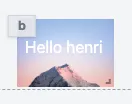

#### HTML Input

|  Type  | Connectable | Templatable |                                          Default                                          | Description                |
| :----: | :---------: | :---------: | :---------------------------------------------------------------------------------------: | -------------------------- |
| string |    true     |    true     | `<h1 class="absolute top-4 left-2 text-white">Hello ${ctx.username}</h1>` | The HTML content to render |

#### Outputs

| Name    |  Type   | Description                              |
| ------- | :-----: | ---------------------------------------- |
| result  | string  | The HTML.                                |
| loading | boolean | The loading state of the HTML component. |

### PDF

The PDF component allows you to display a PDF file.

#### PDF configuration

| Name   |  Type   | Connectable | Templatable |  Default   | Description               |
| ------ | :-----: | :---------: | :---------: | :--------: | ------------------------- |
| Source | boolean |    true     |    true     | /dummy.pdf | The PDF file.             |
| Zoom   | number  |    true     |    true     |    100     | The zoom on the PDF view. |

#### Outputs

| Name    |  Type   | Description                             |
| ------- | :-----: | --------------------------------------- |
| loading | boolean | The loading state of the PDF component. |

### Rich Result

The Rich Result component allows you to display the result of a Runnable. It tries to display the result in a human-readable way.

#### Rich Result configuration

| Name        | Type | Connectable | Templatable |   Default   | Description                         |
| ----------- | :--: | :---------: | :---------: | :---------: | ----------------------------------- |
| Data Source |      |    true     |             | {"foo": 42} | The data source to display results. |

#### Outputs

| Name    |  Type   | Description                         |
| ------- | :-----: | ----------------------------------- |
| result  |         | The result of the runnable.         |
| loading | boolean | The loading state of the component. |

### Log Display

The Log Display component allows you to display the log of a Runnable.

#### Log Display configuration

| Name        | Type | Connectable | Templatable | Default | Description                      |
| ----------- | :--: | :---------: | :---------: | :-----: | -------------------------------- |
| Data Source |      |    true     |             |         | The data source to display logs. |

#### Outputs

| Name    |  Type   | Description                         |
| ------- | :-----: | ----------------------------------- |
| result  |         | The result of the runnable.         |
| loading | boolean | The loading state of the component. |

### Flow Status

The Flow Status component allows you to display the status of a flow.

#### Flow Status configuration

| Name        | Type | Connectable | Templatable | Default | Description                 |
| ----------- | :--: | :---------: | :---------: | :-----: | --------------------------- |
| Data Source |      |    true     |             |         | The flow to display status. |

#### Outputs

| Name    |  Type   | Description                         |
| ------- | :-----: | ----------------------------------- |
| result  |         | The result of the runnable.         |
| loading | boolean | The loading state of the component. |

## Charts

### Bar/Line Chart

The Bar Chart component allows you to display a Bar Chart using the [Chart.js](https://www.chartjs.org/) library. It can also be used to display a Line Chart.

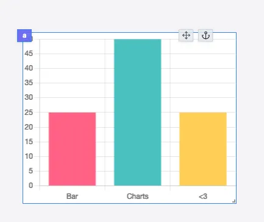

#### Bar/Line Chart Input

|  Type  | Connectable | Templatable | Default | Description         |
| :----: | :---------: | :---------: | :-----: | ------------------- |
| Object |    true     |    false    |         | The bar chart data. |

#### Bar/Line Chart configuration

| Name  |  Type   | Connectable | Templatable | Default | Description                  |
| ----- | :-----: | :---------: | :---------: | :-----: | ---------------------------- |
| Theme | string  |    false    |    false    | Theme1  | The chart theme.             |
| Line  | boolean |    false    |    false    |  false  | Whether to use a line style. |

#### Outputs

| Name    |  Type   | Description                                   |
| ------- | :-----: | --------------------------------------------- |
| result  | Object  | The bar chart data.                           |
| loading | boolean | The loading state of the bar chart component. |

### Pie Chart

The Pie Chart component allows you to display a Pie Chart using the [Chart.js](https://www.chartjs.org/) library.

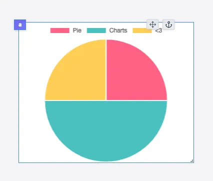

#### Pie Chart Input

|  Type  | Connectable | Templatable | Default | Description         |
| :----: | :---------: | :---------: | :-----: | ------------------- |
| Object |    true     |    false    |         | The pie chart data. |

#### Pie Chart configuration

| Name          |  Type   | Connectable | Templatable | Default | Description                     |
| ------------- | :-----: | :---------: | :---------: | :-----: | ------------------------------- |
| theme         | string  |    false    |    false    | Theme1  | The chart theme.                |
| Doghnut style | boolean |    false    |    false    |  false  | Whether to use a doghnut style. |

#### Outputs

| Name    |  Type   | Description                                   |
| ------- | :-----: | --------------------------------------------- |
| result  | Object  | The pie chart data.                           |
| loading | boolean | The loading state of the pie chart component. |

### Vega Lite

The Vega Lite component allows you to display a Vega Lite chart.

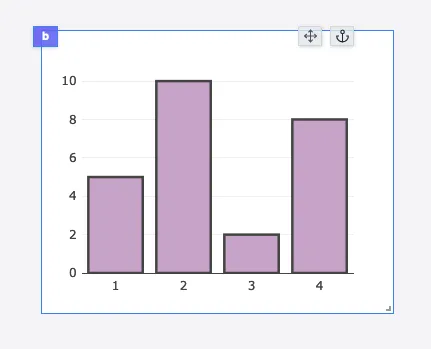

#### Vega Lite Input

|  Type  | Connectable | Templatable | Default | Description                |
| :----: | :---------: | :---------: | :-----: | -------------------------- |
| object |    true     |    false    |         | The Vega Lite chart config |

#### Vega Lite configuration

| Name   |  Type   | Connectable | Templatable | Default | Description                                                               |
| ------ | :-----: | :---------: | :---------: | :-----: | ------------------------------------------------------------------------- |
| canvas | boolean |    false    |    false    |  false  | Use the canvas renderer instead of the svg one for more interactive plots |

#### Outputs

| Name    |  Type   | Description                              |
| ------- | :-----: | ---------------------------------------- |
| result  | Object  | The Vega Lite chart data.                |
| loading | boolean | The loading state of the Vega Lite chart |

### Plotly

The Plotly component allows you to display a Plotly chart.

#### Plotly Input

|  Type  | Connectable | Templatable | Default | Description             |
| :----: | :---------: | :---------: | :-----: | ----------------------- |
| object |    true     |    false    |         | The Plotly chart config |

#### Outputs

| Name   |  Type  | Description            |
| ------ | :----: | ---------------------- |
| result | Object | The Plotly chart data. |

### Scatter Chart

The Scatter Chart component allows you to display a Scatter Chart using the [Chart.js](https://www.chartjs.org/) library.

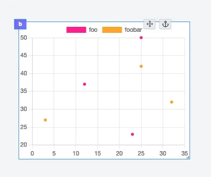

#### Scatter Chart Input

|      Type       | Connectable | Templatable | Default | Description             |
| :-------------: | :---------: | :---------: | :-----: | ----------------------- |
| `Array<Object>` |    true     |    false    |         | The scatter chart data. |

#### Scatter Chart configuration

| Name     |  Type   | Connectable | Templatable | Default | Description                      |
| -------- | :-----: | :---------: | :---------: | :-----: | -------------------------------- |
| zoomable | boolean |    false    |    false    |  false  | Whether to use a zoomable style. |
| panable  | boolean |    false    |    false    |  false  | Whether to use a panable style.  |

#### Outputs

| Name    |  Type   | Description                                       |
| ------- | :-----: | ------------------------------------------------- |
| result  | Object  | The scatter chart data.                           |
| loading | boolean | The loading state of the scatter chart component. |

### Timeseries

The Timeseries component allows you to display a Timeseries using the [Chart.js](https://www.chartjs.org/) library.

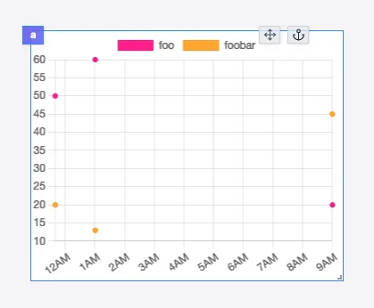

#### Timeseries Input

|      Type       | Connectable | Templatable | Default | Description          |
| :-------------: | :---------: | :---------: | :-----: | -------------------- |
| `Array<Object>` |    true     |    false    |         | The timeseries data. |

#### Timeseries configuration

| Name              |  Type   | Connectable | Templatable | Default | Description                         |
| ----------------- | :-----: | :---------: | :---------: | :-----: | ----------------------------------- |
| Logarithmic scale | boolean |    false    |    false    |  false  | Whether to use a logarithmic scale. |
| zoomable          | boolean |    false    |    false    |  false  | Whether to use a zoomable style.    |
| panable           | boolean |    false    |    false    |  false  | Whether to use a panable style.     |

#### Outputs

| Name    |  Type   | Description                                    |
| ------- | :-----: | ---------------------------------------------- |
| result  | Object  | The timeseries data.                           |
| loading | boolean | The loading state of the timeseries component. |

### ChartJs

The ChartJs component allows you to display a ChartJs using the [Chart.js](https://www.chartjs.org/) library.

<video
    className="border-2 rounded-xl object-cover w-full h-full dark:border-gray-800"
    autoPlay
    loop
    controls
    src="/videos/chartjs.mp4"
    alt="horizontal split panes"
/>
 

#### ChartJs Input

|    Type     | Connectable | Templatable |       Default        | Description                            |
| :---------: | :---------: | :---------: | :------------------: | -------------------------------------- |
| Data source |    true     |    false    | {"label":["Pie"]...} | The Json source of the displayed data. |

#### ChartJs configuration

|  Type   | Connectable | Templatable | Default | Description                                                                          |
| :-----: | :---------: | :---------: | :-----: | ------------------------------------------------------------------------------------ |
|  Type   |    false    |    false    |   Pie   | The type of the chart (bar, bubble, doughnut, line, pie, polarArea, radar, scatter). |
| Options |    true     |    false    |  none   | ChartJs [options](https://www.chartjs.org/docs/latest/general/options.html) object.  |

#### Outputs

| Name   |  Type  | Description       |
| ------ | :----: | ----------------- |
| result | Object | The ChartJs data. |
