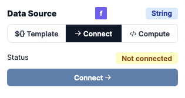
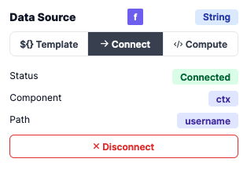

# Settings

The settings panel allows you to configure a component. Once a component is selected, the settings panel will display the component's properties.

The panel is divided into six sections:

- **Data Source**: configure the data source of the component. Each data source has a type, and its corresponding editor.
- **Configuration**: configure the component properties.
- **Alignment**: configure the component alignment. The alignment is relative to the parent component.
- **Recompute others**: recompute the other components when the current component is updated.
- **Custom CSS**: add custom CSS to the component. They are two ways to add custom CSS
- **Copy/Move**: We list all the shortcut that can be used to manipulate the component:
  - **Copy**: `Ctrl + C` or `Cmd + C`
  - **Paste**: `Ctrl + V` or `Cmd + V`
  - **Cut**: `Ctrl + X` or `Cmd + X`
  - **Delete**: `Del`
  - **Move**: We can use arrow keys to move the component. They are two behaviors:
    - **Left/Right**: move to the next or previous at the same level.
    - **Up/Down**: Navigate to the parent or the first child of a container.
  - **Escape**: deselect the component.

### Data Source

Windmill supports the following data sources types, as well as the corresponding array types:

- **Text**: a simple text input.
- **Text area**: a multi-line text input.
- **Number**: a number input.
- **Boolean**: a checkbox.
- **Date**: a date picker. The date format is `DD.MM.YYYY`.
- **Template**
- **Object**: a JSON editor.
- **Select**: a dropdown list.
- **Color**: a color picker. The color format is `#RRGGBB`.

The data source is the data that will be used by the component. For example, the `Text` component will display the text that is defined in the data source.
They are 4 ways to define the data source, depending on the component:

- **Static**: the data source is defined in the settings panel.
- **Connect**: the data source is connected to the output of another component, to an output of a background script, the state or the context.
- **Compute**: the data source is the result of a script
- **Template**: the data source is a result of a template. A template is a special type of input where we can use variables. For example, if we have a variable `username` the context, we can use it in the template like this: `Hello ${username}}`. Not all components support templates.

#### Static

Each type of data source has a different editor. For example, the `Text` data source has a simple text input, while the `Object` data source has a JSON editor.

#### Connect

The data source can be connected to the output of another component, to an output of a background script, the state or the context.

The status of the connection if displayed.

After a connection is made, the status of the connection is updated, the connection is displayed.

#### Compute

The data source can be computed using a script. The script is executed when the component is rendered.
They are two ways to define the script:

- **Inline**: the script is defined in the settings panel.
- **Select from workspace**: the script of flow is defined in the workspace.

Once the script is defined, we can see the script in the Runnable pannel

##### Tranformers

A transformer is an optional frontend script that is executed right after the component's script whose purpose is to do lightweight transformation in the browser. It takes the previous computation's result as `result`.

### Configuration

Each component has a set of properties that can be configured. For example, the `Button` component has a `label` property that can be configured.

### Alignment

The alignment is relative to the parent component, and be either horizontal or vertical.

### Recompute others

When a component is updated, we can choose to recompute the other components, to trigger a re-rendering for example.

### Custom CSS

You can add custom CSS to the component. They are two ways to add custom CSS:

- **Plain CSS**: add a CSS class to the component. For example: `background-color: red;`
- **Tailwind classes**: add a Tailwind class to the component. For example: `bg-red-500`.

:::tip Styling

More details on styling in Windmill App Editor on our [dedicated section](./8_app_styling.md).

:::