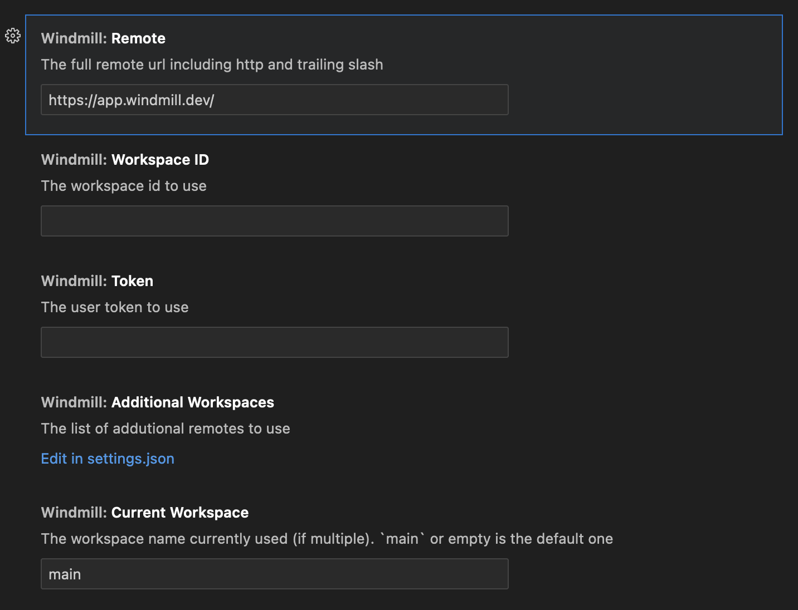

# VSCode Extension

The Windmill VSCode extension allows you to run your scripts and preview the output within VSCode. This feature lets you preview your work without leaving your code editor.

## Installation

1. Open VSCode and click on the Extensions icon on the Activity Bar on the side of the window.
2. Search for "Windmill" and select the Windmill extension by Windmill Labs.
3. Click on the Install button.

You can also follow this link to the extension page on the VSCode marketplace: [Install it](https://marketplace.visualstudio.com/items?itemName=windmill-labs.windmill)

## Quick Start

Open the command menu (Ctrl/Cmd+Shift+P) and run:

`> Windmill: Configure workspace, remote and token`

In the settings menu, set the remote url, workspace name and token.

Once done, on any page you'd like to edit, run:

`> Windmill: Run preview in the current editor`

The keybidings for that command are: Ctrl+Enter and Shfit+Enter.

## Features

- The extension will automatically detect the current scripts and load the schema.
- Run your scripts and preview the output within VSCode.
- Review logs and results
- Check run history

## Commands

Access these commands through the Command Palette (Ctrl/Cmd+Shift+P):

| Command                                              | Description                                                                                                                                                                                         |
| ---------------------------------------------------- | --------------------------------------------------------------------------------------------------------------------------------------------------------------------------------------------------- |
| **Windmill: Show Preview**                           | This command launches a preview of your script in a new tab.                                                                                                                                        |
| **Windmill: Run Preview**                            | Runs the current script and provides a preview within the VSCode environment. This feature lets you preview your work without leaving your code editor.                                             |
| **Windmill: Configure Remote, Workspace, and Token** | Opens a setup wizard to configure your environment. This includes settings for the remote URL, workspace, and user token. You only need to do this once or when changing your environment settings. |
| **Windmill: Switch Windmill Workspace**              | Allows you to switch between different workspaces.                                                                                                                                                  |
| **Windmill: Add a Workspace**                        | Adds a new workspace to your configuration.                                                                                                                                                         |

## Settings

The extension provides the following settings:

| Setting                         | Description                                                                                                  |
| ------------------------------- | ------------------------------------------------------------------------------------------------------------ |
| `windmill.remote`               | The full remote URL including http and trailing slash. By default, it's "https://app.windmill.dev/".         |
| `windmill.workspaceId`          | The workspace id to use.                                                                                     |
| `windmill.token`                | The token to use to authenticate with the remote and workspace.                                              |
| `windmill.additionalWorkspaces` | The list of additional remotes to use. This allows you to set up multiple workspaces for different projects. |
| `windmill.currentWorkspace`     | The workspace name currently used (if multiple). main or empty is the default one.                           |

You can create a user token in the Windmill app. Follow the instructions in the [Windmill docs](https://docs.windmill.dev/docs/core_concepts/webhooks#user-token).

## Usage

1. Setup: After installing the extension, use the Windmill: Configure Remote, Workspace and Token command to setup your Windmill environment.

2. Run Scripts: Use the Windmill: Show Preview or Windmill: Run Preview command to run your scripts and preview the output within VSCode.

3. Switch Workspaces: Use the Windmill: Switch Windmill Workspace command to switch between your Windmill workspaces.

4. Add Workspaces: If you work with multiple projects, use the Windmill: Add a Windmill Workspace command to add a new workspace.
