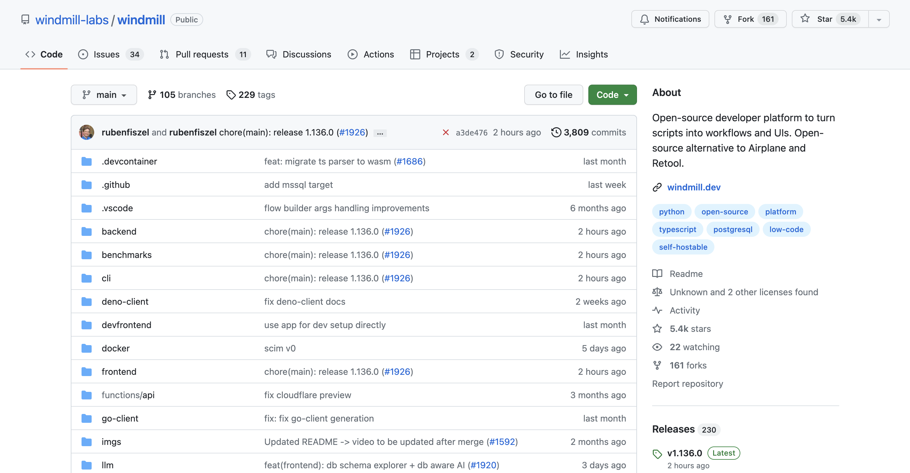
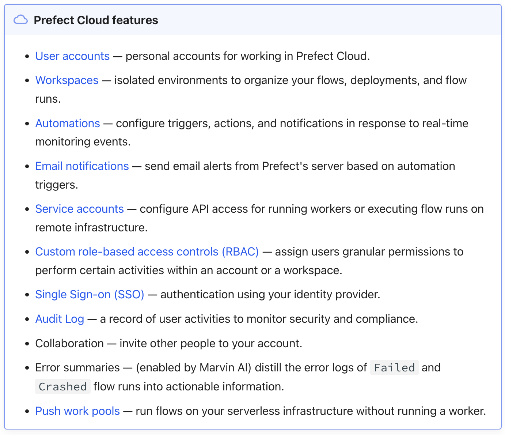
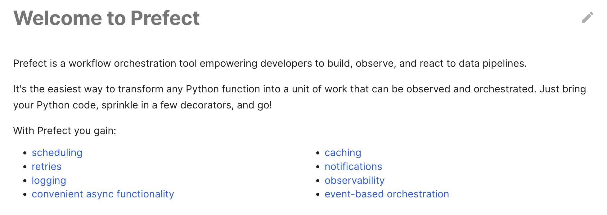
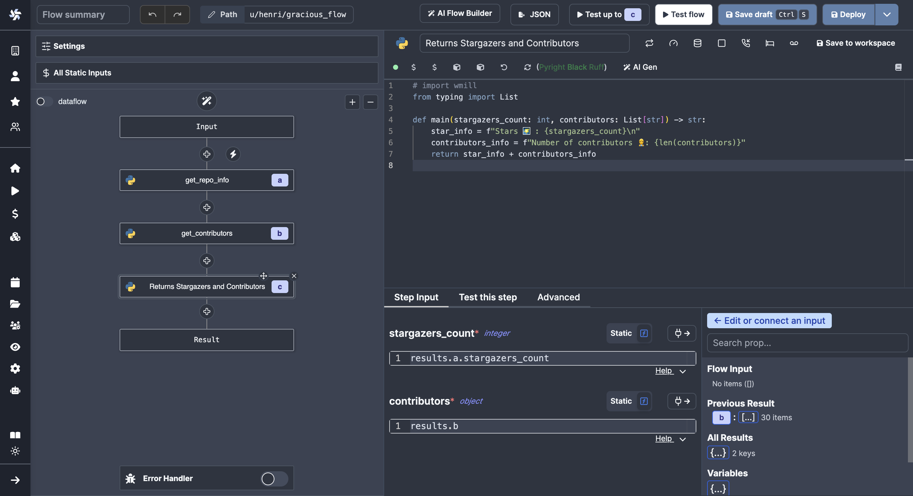
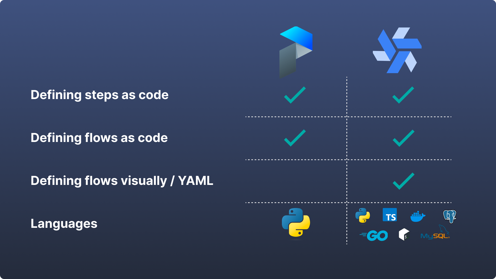
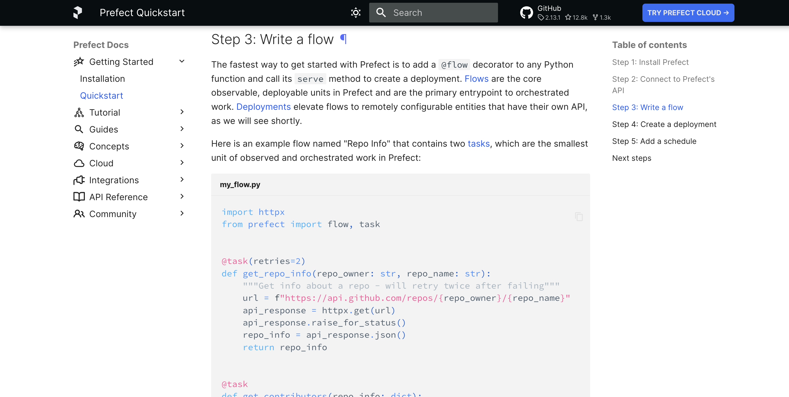
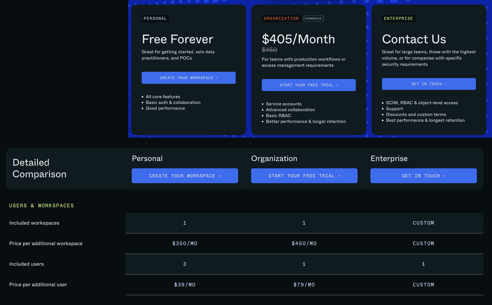
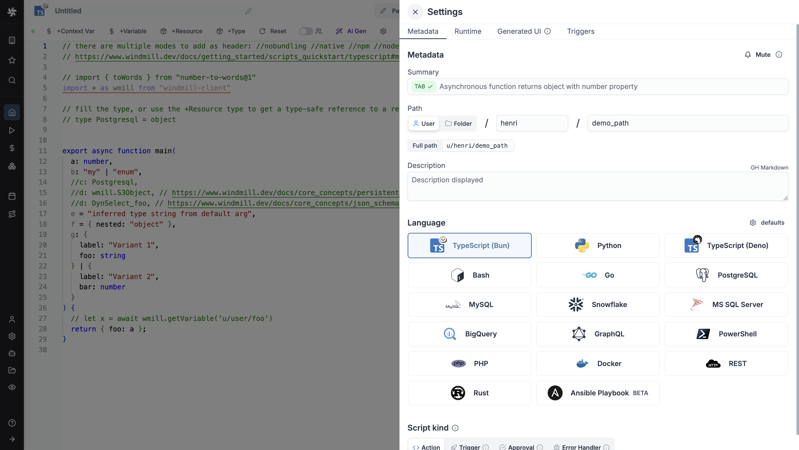
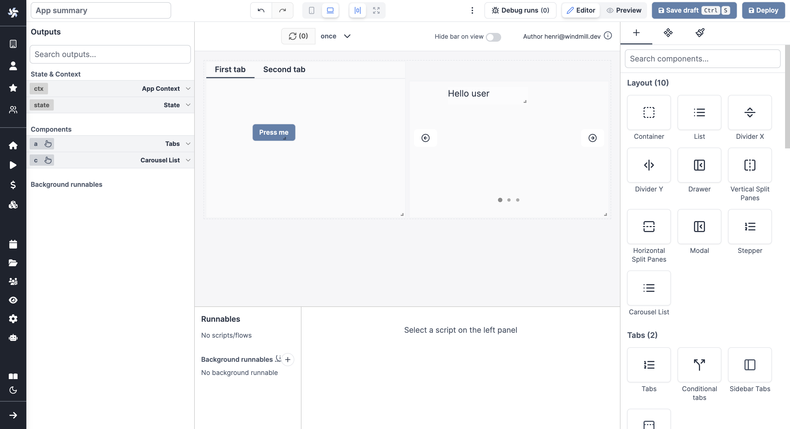

import DocCard from '@site/src/components/DocCard';

# Alternative to Prefect for building Workflows

Both Windmill and Prefect support writing complex workflows and ETL with code and run them at scale.
We highlight below the main differences between the 2 on the following axis:
- [Alternative to Prefect for building Workflows](#alternative-to-prefect-for-building-workflows)
	- [Open Source and Hosting](#open-source-and-hosting)
	- [Workflows and Code](#workflows-and-code)
	- [Triggers](#triggers)
	- [Execution Runtime and Coldstarts](#execution-runtime-and-coldstarts)
		- [Benchmark #1](#benchmark-1)
		- [Benchmark #2](#benchmark-2)
	- [Observability and Monitoring](#observability-and-monitoring)
	- [AI Generation](#ai-generation)
	- [Pricing](#pricing)
	- [Scripts and Apps](#scripts-and-apps)

<a href="https://www.prefect.io/" rel="nofollow">Prefect</a> is a data workflow management system, designed to help teams build, run, and monitor data workflows. It provides tools for orchestrating data pipelines, managing their execution, and ensuring data integrity.

## Open Source and Hosting

[Windmill](https://www.windmill.dev/) is fully open source. This implies that Windmill can be self-hosted with just a few commands, providing cost-effective and secure solutions.

Windmill offers a clean slate, allowing you to fully explore its platform before committing to the product.
Windmill's open-source nature ensures that the platform is tested, approved, and continuously enhanced
to meet the community's needs.

Windmill provides and integrates into its platform a [public Community Hub](https://hub.windmill.dev/)
where users share useful and proven scripts, flows, and applications.

	<DocCard
		title="Windmill's GitHub"
		description="Windmill's official repository."
		href="https://github.com/windmill-labs/windmill"
	/>
    <DocCard
		title="Self Host Windmill tutorial"
		description="Self host Windmill in 2 minutes."
		href="/docs/advanced/self_host/"
	/>
    <DocCard
		title="Contributor Guide"
		description="Contribute to our codebase, Windmill Hub or our Discord."
		href="/docs/misc/contributing"
	/>

Prefect has an Apache v2.0 License and can be self-hosted.

Prefect's [monitoring](#observability--monitoring) is done through a cloud platform that requires subscription. Many of the features necessary for its proper functioning are only available under Prefect Cloud:

## Workflows and Code

Prefect and Windmill Flow Editor have a very similar sets of features. Below are the advanced features presented by Prefect and, in backlink, their counterpart on Windmill:

- [scheduling](../core_concepts/1_scheduling/index.md)
- [retries](../flows/14_retries.md)
- [logging](../core_concepts/14_audit_logs/index.mdx)
- [convenient async functionality](../core_concepts/4_webhooks/index.md#asynchronous)
- [caching](../flows/4_cache.mdx)
- [notifications](../core_concepts/1_scheduling/index.md#be-notified-every-time-a-scheduled-workflow-has-been-executed)
- [observability](../core_concepts/5_monitor_past_and_future_runs/index.mdx)
- [event-based orchestration](../getting_started/9_trigger_flows/index.mdx)

We could also mention [storage of configuration](../core_concepts/3_resources_and_types/index.mdx) or [error handling](../core_concepts/10_error_handling/index.mdx) that are dealt with in a similar manner.

The difference between Prefect and Windmill lies in the method of building flows.

Prefect is heavily code-based. Everything is and can only be defined in Python. The steps and their configurations are defined by code:

> [Flow](#benchmark-1) _Given a GitHub repository, logs the number of stargazers and contributors for that repo_ on Prefect.

 

In Windmill, the steps are also code-based but built from scripts ([TypeScript](../getting_started/0_scripts_quickstart/1_typescript_quickstart/index.mdx), [Python](../getting_started/0_scripts_quickstart/2_python_quickstart/index.mdx), [Go](../getting_started/0_scripts_quickstart/3_go_quickstart/index.mdx), [Bash](../getting_started/0_scripts_quickstart/4_bash_quickstart/index.mdx), [SQL](../getting_started/0_scripts_quickstart/5_sql_quickstart/index.mdx) ...). Users can write the code directly, choose a script from the workspace, the community library [WindmillHub](https://hub.windmill.dev/), or have it [generated with AI](#ai-generation). Each script can be saved with [permissions](../core_concepts/16_roles_and_permissions/index.mdx) set from the workspace.

The structuring of the flow and the configurations for each step are defined from a User Interface. With a _code when you need_ mindset, the user can navigate the flow editor in low-code.

> [Flow](#benchmark-1) _Given a GitHub repository, logs the number of stargazers and contributors for that repo_ on Windmill.

 

In particular, Windmill [generates automatically UIs](../core_concepts/6_auto_generated_uis/index.md) for flows and steps and lets users [test](../core_concepts/23_instant_preview/index.mdx) flows, steps or flow until a given step, from the UI.

Flows can be [defined visually / YAML](../advanced/4_local_development/index.mdx) on a local environment. Windmill will soon unveil an extension to facilitate the editing of flows in local development.

## Triggers

Prefect uses a deployment system from the terminal to trigger and schedule its flows.

To manage its triggers from the Prefect UI, you have to go through a separate menu called <a href="https://docs.prefect.io/latest/concepts/automations/" rel="nofollow">Automations</a> (available on the Prefect cloud only) and go through many actions before actually triggering the flow.

While Windmill also allows configuration and triggers from the terminal, the platform is designed to schedule, manually trigger, generate webhooks or UIs from the Windmill UI (cloud or self-hosted).

<video
    className="border-2 rounded-xl object-cover w-full h-full dark:border-gray-800"
    controls
    src="/videos/schedule-cron-menu.mp4"
/>
 

> Example of a flow scheduled manually via the UI on Windmill.

 

	<DocCard
		title="Triggering Flows"
		description="Trigger flows on-demand, by schedule or on external events."
		href="/docs/getting_started/trigger_flows"
	/>

## Execution Runtime and Coldstarts

Windmill's architecture allows runnning each task on the current fleet of worker
(which you can auto-scale automatically) and hence do not suffer from cold start.
Isolation and creating dedicated dependency environment is the secret sauce that makes Windmill
the fastest execution runtime for scripts (10ms cold start).

Windmill can run 26M tasks a month on a single worker costing 5$. Prefect does not provide figures on its average runtime and performance.

Also, Windmill has a [transparent API](https://app.windmill.dev/openapi.html#/), on which you could imagine launching 1m simulateously by API.

To be completely transparent, we have not yet conducted advanced and at-scale benchmarks with Prefect.
But for comparison, you will find below the tests between Prefect and Windmill for cold start, execution, and result of a [flow shared by Prefect](#benchmark-1), and of a [Python script](#benchmark-2).

Each instance is self-hosted.

### Benchmark #1

Flow "Given a GitHub repository, logs the number of stargazers and contributors for that repo", <a href="https://docs.prefect.io/latest/getting-started/quickstart/#step-3-write-a-flow" rel="nofollow">shared by Prefect</a> on their quickstart (at date 09.20.23):

- Prefect: Cold start + Execution + Results = 8.09s
- Windmill: Cold start + Execution + Results = 1.13s

<video
    className="border-2 rounded-xl object-cover w-full h-full dark:border-gray-800"
    controls
    src="/videos/windmill_prefect_flow.mp4"
/>

### Benchmark #2

_Slowfunction_ that makes imports and loops from 11^7 down to 0. For each number i in that range:
- Calculates the arctangent (math.atan(i)) of the number.
- Calculates the tangent (math.tan(i)) of the number.
- Multiplies the two results together and adds them to the result.
And records the end time once the loop finishes and then calculates the elapsed time.

- Prefect: Cold start + Execution + Results = 8.09s
- Windmill: Cold start + Execution + Results = 12.33s

<video
    className="border-2 rounded-xl object-cover w-full h-full dark:border-gray-800"
    controls
    src="/videos/windmill_prefect_slow.mp4"
/>

 

Trust but verify: to ensure the performance of Windmill's workers and measure their capabilities,
we provide a benchmarking tool. This tool allows you to benchmark the execution of jobs and flows,
providing insights into the performance metrics.

	<DocCard
		title="Benchmarks"
		description="This folder includes a small deno/ts utility to benchmark execution of jobs and flows."
		href="https://github.com/windmill-labs/windmill/tree/main/benchmarks"
	/>
	<DocCard
    	title="OpenAPI"
    	description="Interact with Windmill."
    	href="https://app.windmill.dev/openapi.html"
    />

## Observability and Monitoring

In terms of monitoring and observability, Windmill and Prefect's cloud app fulfill the same functions: audit logs, monitoring of runs and schedules, saving of flows, configurations (<a href="https://docs.prefect.io/latest/concepts/blocks/?h=blocks" rel="nofollow">Blocks</a> in Prefect, [Resource Types](../core_concepts/3_resources_and_types/index.mdx) in Windmill) and variables, [allocation of workers](../core_concepts/9_worker_groups/index.mdx).

The main difference is that Prefect's application seems to be conceived as a reliable source for reporting actions from Prefect, whereas with Windmill, the application provides more control as everything can be done from the Windmill app (creation of scripts, flows apps, triggers, monitoring, [permissions](../core_concepts/16_roles_and_permissions/index.mdx), etc.)

<video
	className="border-2 rounded-xl object-cover w-full h-full dark:border-gray-800"
	controls
	id="monitoring"
	src="/videos/runs-menu.mp4"
/>

 

	<DocCard
    	title="Roles and Permissions"
    	description="Control access and manage permissions within your instance and workspaces."
    	href="/docs/core_concepts/roles_and_permissions"
    />
    <DocCard
    	title="Monitor Past and Future Runs"
    	description="Get an aggregated view of past and future runs on your workspace."
    	href="/docs/core_concepts/monitor_past_and_future_runs"
    />
    <DocCard
    	title="Audit Logs"
    	description="Windmill provides audit logs for every operation and action that has side-effects."
    	href="/docs/core_concepts/audit_logs"
    />
    <DocCard
    	title="Workers and Worker Groups"
    	description="Worker Groups allow users to run scripts and flows on different machines with varying specifications."
    	href="/docs/core_concepts/worker_groups"
    />

## AI Generation

Windmill provides ways to have AI help you in your coding experience. From prompts, generate scripts that interact with your integrations, or flows where the AI manages the data transmission between steps, or even automatic error resolution.

<video
    className="border-2 rounded-xl object-cover w-full h-full dark:border-gray-800"
    controls
    src="/videos/flow_ai_builder.mp4"
/>

 

	<DocCard
    	title="AI Generation"
    	description="Have AI complete code on Windmill."
    	href="/docs/code_editor/ai_generation"
    />

## Pricing

Windmill has a [transparent pricing policy](../misc/7_plans_details/index.mdx), with clear steps for implementation.

Windmill is cheaper at scale and can be used for free at any scale thanks to its open source nature.

As of September 20, 2023, Prefect does not disclose its Enterprise pricing (see below). Its Organization pricing is more expensive than Windmill's Team Plan.

Prefect pricing:

	<DocCard
		title="Pricing"
		description="Windmill's subscription plans and simulations."
		href="/pricing"
	/>
    <DocCard
		title="Plans Details and Subscriptions"
		description="Windmill transparently provides the content and pricing of its upgraded plans."
		href="/docs/misc/plans_details"
	/>

## Scripts and Apps

This document has focused on the Flow Editor since it is the product closest to what Prefect does. However, Windmill also includes Script and App editors.

The [script editor](../script_editor/index.mdx) allows users to build long-running heavy background jobs, script with complex dependencies, endpoints with high rpm or simple one-off tasks without any overhead. They can be triggered them from a webhook, auto-generated UIs, flows, apps etc.

	<DocCard
		title="Scripts Quickstart"
		description="Scripts are the basic building blocks that can be written in Typescript, Python, Go, Bash, SQL or launch docker containers."
		href="/docs/getting_started/scripts_quickstart"
	/>

The [app editor](../apps/0_app_editor/index.mdx) goes beyond auto-generated UIs and allows you to create your own customized UIs using drag-and-drop from components powered by Windmill scripts and flows.

	<DocCard
		title="Apps Quickstart"
		description="Apps are customized, user-friendly interfaces built using a drag-and-drop editor."
		href="/docs/getting_started/apps_quickstart"
	/>

In conclusion, Prefect is an excellent tool for building workflows and heavy data ETL. From Windmill's perspective, Prefect's flows don't lack major features.

However, Windmill distinguishes itself from Prefect by providing more control for building and monitoring flows, as well as scripts and UIs, all from a single open-source platform.