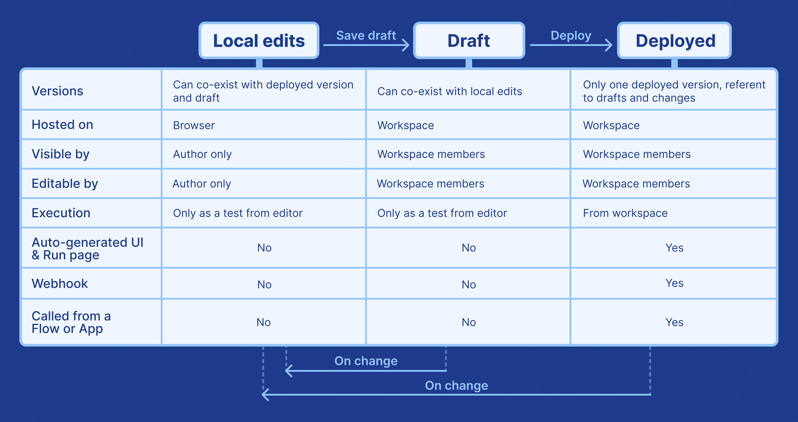

# Draft and Deploy

Windmill lets you to iterate on scripts, flows and apps before deploying them.

Each script, flow or app can go through 3 states: local edit, draft and deployed.

<video
    className="border-2 rounded-xl object-cover w-full h-full"
    autoPlay
    controls
    id="main-video"
    src="/videos/draft_and_deploy.mp4"
/>

## Local Edits

All changes on a runnable (script, flow or app) are only on your browser until validated "Draft" or "Deploy". Until then, they are only visible locally.

Local edits can be run and tested only from the editor (script, flow or app) with the `Test`button.

## Draft

Local edits can be saved as Draft as a staging state. A draft is visible from members of the workspace and can be edited. There is only one draft per runnable.

Drafts can be run and tested only from the editor (script, flow or app) with the `Test`button.

## Deployed Version

The deployed version is authoritative for a runnable. Once deployed, it is not only visible by workspace members but has its own [auto-generated UI](../6_auto_generated_uis/index.md), [webhooks](../4_webhooks/index.md), or can be called from flows and apps (for sripts and flows). It also means that local edits and drafts can be made in parallel of a Deployed version of a runnable but won't affect its behavior.

:::info Deployed versions for scripts

Scripts have as many deployed versions as they have Hash -> Ruben

:::

If you want to have several versions of the same runnable, just fork it with the `Fork`button on the drop down menu of `Deploy`.

