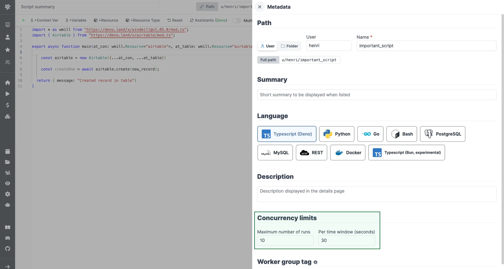
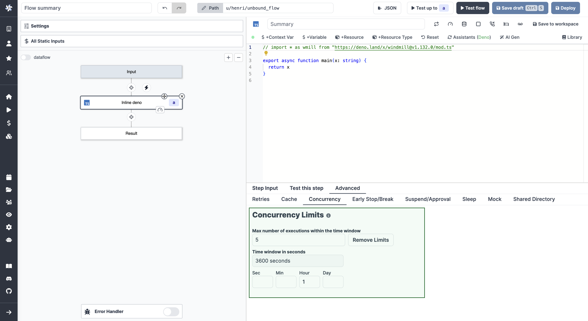

# Concurrency Limits

The Concurrency Limits feature allows you to define concurrency limits for scripts, flows and inline scripts within flows. Its primary goal is to prevent exceeding the API Limit of the targeted API, eliminating the need for complex workarounds using worker groups.

The Concurrency Limit operates globally and across flow runs. It involves two key parameters: "Maximum number of runs" and the "Per time window (seconds)."

When jobs reach the concurrency limit, they are automatically queued for execution at the next available optimal slot given the time window.

Concurrency limit is a [Cloud and Pro & Enterprise Self-Hosted](../../misc/7_plans_details/index.mdx) only.

## Concurrency limit of Script

Concurrency limit can be set from the Settings menu. Pick "Concurrency" and define a time window and max number of executions of the flow within that time window.

## Concurrency limit of flow

From the Flow Settings menu, pick "Concurrency" and define a time window and max number of executions of the flow within that time window.

## Concurrency limit of scripts within flow

The Concurrency Limit operates globally and across flow runs. It involves two key parameters: "Maximum number of runs" and the "Per time window (seconds)."

Concurrency limit can be set for each step of a flow in the `Advanced` menu, on tab "Concurrency".

