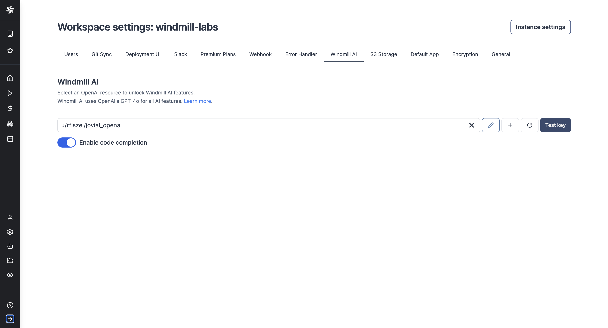

# Windmill AI

Windmill provides ways to have AI help you in your coding experience.

:::info OpenAI Integration

If you're rather interested in leveraging OpenAI from your scripts, flows and apps, check [OpenAI Integration](../../integrations/openai.md).

:::

To enable Windmill AI, go to the "Windmill AI" tab in the workspace settings and add an [OpenAI resource](../../integrations/openai.md). Code completion is disabled by default, but you can enable it in the same tab.

:::caution

Windmill AI requires access to GPT-4 for code generation/editing/fixing and GPT-3.5-turbo for code completion.

:::

## Windmill AI for Scripts

Generate Windmill-specific code from simple text. All languages that can be run on Windmill are supported.

### Code Generation

<video
    className="border-2 rounded-xl object-cover w-full h-full dark:border-gray-800"
    controls
    src="/videos/ai_generation.mp4"
/>

 

In a [code editor](../../code_editor/index.mdx) (Script, Flow, Apps), click on `AI` and write a prompt describing what the script should do. The script will follow Windmill's main requirements and features (exposing a main function, importing libraries, using resource types, declaring required parameters with types). Moreover, when creating an SQL or GraphQL script, the AI assistant will take into account the database/GraphQL API schema **when selected**.

:::tip Pro tips
The AI assistant is particularly effective when generating Python and TypeScript (Bun runtime) scripts, so we recommend using these languages when possible.
Moreover, you will get better results if you specify in the prompt what the script should take as parameters, what it should return, the specific integration and libaries it should use if any. 
For instance, in the demo video above we wanted to generate a script that fetches the commits of a Github repository passed as a parameter, so we wrote: `fetch and return the commits of a given repository on Github using octokit`.
:::

### Code Editing

Inside the `AI Gen` popup, you can choose to edit the existing code rather than generating a new one. The assistant will modify the code according to your prompt.

<video
    className="border-2 rounded-xl object-cover w-full h-full dark:border-gray-800"
    controls
    src="/videos/ai_edit.mp4"
/>

### Code Fixing

Upon error when executing code, you will be offered to "AI Fix" it. The assistant will automatically read the code, explain what went wrong, and suggest a way to fix it.

<video
    className="border-2 rounded-xl object-cover w-full h-full dark:border-gray-800"
    controls
    src="/videos/ai_fix.mp4"
/>

## Windmill AI for Flows

Generate Workflows from prompts. 

Windmill AI for Flows support two creation modes: Sequence Flows and Trigger Flows. 
In both cases, you specify a prompt for each step. The AI assistant will then generate the code step by step and link them together.
You will have the opportunity at the end of each step to review, edit or even regenerate the step's code.

For each action, you can either choose a script from the [Hub](https://hub.windmill.dev/) or generate one from scratch using Windmill AI. 
At the end of the process, flow inputs are inferred and you just need to fill them in.

### Sequence Flows

Generate a flow consisting of a sequence of scripts.

<iframe
    style={{ aspectRatio: '16/9' }}
    src="https://www.youtube.com/embed/y-pV6CShdZA?vq=hd1080"
    title="YouTube video player"
    frameBorder="0"
    allow="accelerometer; autoplay; clipboard-write; encrypted-media; gyroscope; picture-in-picture; web-share"
    allowFullScreen
    className="border-2 rounded-xl object-cover w-full dark:border-gray-800"
></iframe>

### Trigger Flows

Generate a flow with two scripts, one that regularly checks for changes in an external system and a second that is executed for each change using a [for-loop](../../flows/12_flow_loops.md).

<iframe
    style={{ aspectRatio: '16/9' }}
    src="https://www.youtube.com/embed/4HTIKOAyVIg?vq=hd1080"
    title="YouTube video player"
    frameBorder="0"
    allow="accelerometer; autoplay; clipboard-write; encrypted-media; gyroscope; picture-in-picture; web-share"
    allowFullScreen
    className="border-2 rounded-xl object-cover w-full dark:border-gray-800"
></iframe>

 

The inputs of the for-loop action are automatically filled in with the ouputs of the trigger step.

Moreover, The flow is automatically set to run every 15 minutes when deployed. The [schedule](../1_scheduling/index.md) can then be customized (e.g. every 30 seconds etc.).
This allows you to avoid relying on webhooks sent by external APIs, which can be tedious to configure.

## Windmill AI Code Completion

When Code Completion is enabled, Windmill AI suggests completions as you type in all code editors (Script, Flow, Apps).

<video
    className="border-2 rounded-xl object-cover w-full h-full dark:border-gray-800"
    controls
    src="/videos/code_autopilot.mp4"
/>

