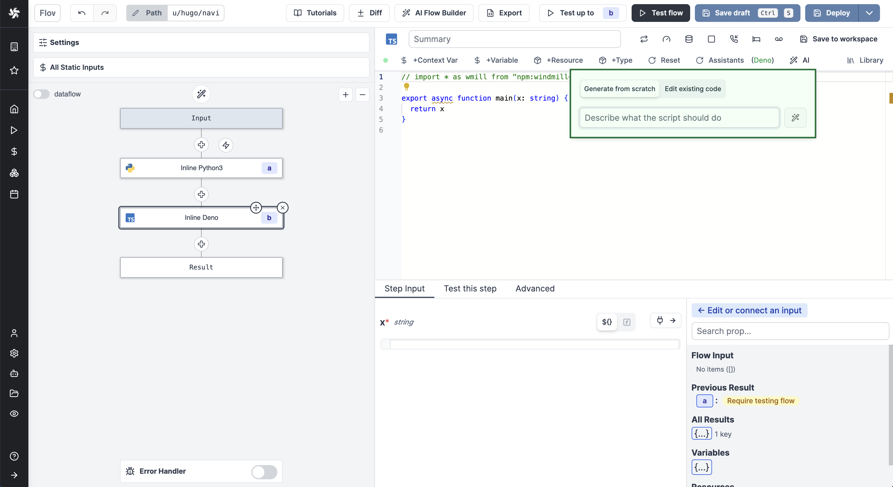

# Windmill AI

Windmill provides ways to have AI help you in your coding experience.

:::info OpenAI Integration

If you're interested leveraging OpenAI from your scripts, flows and apps, check [OpenAI Integration](../../integrations/openai.md).

:::

## Windmill AI for Scripts

Generate Windmill-specific code from simple text.

On the workspace settings, go to the "OpenAI Credentials" tab and add an [OpenAI resource](../../integrations/openai.md).

:::caution

Code generation on Windmill from OpenAI only works on GPT-3.5-turbo and GPT-4 so far.

:::

### Code Generation

<video
    className="border-2 rounded-xl object-cover w-full h-full dark:border-gray-800"
    controls
    src="/videos/ai_generation.mp4"
/>

 

From a [code editor](../../code_editor/index.mdx) (Script, Flow, Apps), click on `AI Gen` and write with a prompt what the script should do. The script will use Windmill's main requirements and features (exposing a main function, importing libraries, using resource types, declaring required parameters with types, leveraging database schema).

### Code Edition

When in the [code editor](../../code_editor/index.mdx), select the code section you want to edit and the "AI Gen" button will turn into "AI Edit", letting you enter instructions for the AI Assistant.

You will then be offered to accept or decline the suggested code.

<video
    className="border-2 rounded-xl object-cover w-full h-full dark:border-gray-800"
    controls
    src="/videos/ai_edit.mp4"
/>

### Code Fixing

Upon error when executing code, you will be offered to "AI Fix" it. The assistant will automatically read the code, explain what went wrong, and suggest a way to fix it.

<video
    className="border-2 rounded-xl object-cover w-full h-full dark:border-gray-800"
    controls
    src="/videos/ai_fix.mp4"
/>

## Windmill AI for Flows

Generate flows from prompts.

### Sequence Flows

Describe the sequence of actions you wish to execute, and the AI Flow builder will write all the steps, link them together, and allow you to trigger the flow manually.

<video
    className="border-2 rounded-xl object-cover w-full h-full dark:border-gray-800"
    controls
    src="/videos/flow_ai.mp4"
/>

### Trigger Flows

Build a flow with two scripts, one that regularly checks for changes in an external system and a second that is executed for each change using a [for-loop](../../flows/12_flow_loops.md).

<video
    className="border-2 rounded-xl object-cover w-full h-full dark:border-gray-800"
    controls
    src="/videos/flow_ai_trigger.mp4"
/>

 

For both steps, you can either choose a script from the [Hub](https://hub.windmill.dev/) or generate one from scratch using Windmill AI. The inputs of the for-loop action are automatically filled in with the ouputs of the trigger step. At the end of the process, flow inputs are inferred and you just need to fill them in.

The flow is automatically set to run every 15 minutes when deployed. The [schedule](../1_scheduling/index.md) can then be customized (e.g. every 30 seconds etc.)

This allows you to avoid relying on webhooks sent by external APIs, which can be tedious to configure.

## Windmill AI Code Completion

Windmill comes with its own code code-completion system.

<video
    className="border-2 rounded-xl object-cover w-full h-full dark:border-gray-800"
    controls
    src="/videos/code_autopilot.mp4"
/>

 

All you need to do is enter an [OpenAI resource](../../integrations/openai.md) with GPT 3.5 or GPT 4 key from the workspace settings and check "Enable code completion", and code suggestions will be provided in any [code editor](../../code_editor/index.mdx) for any language.

