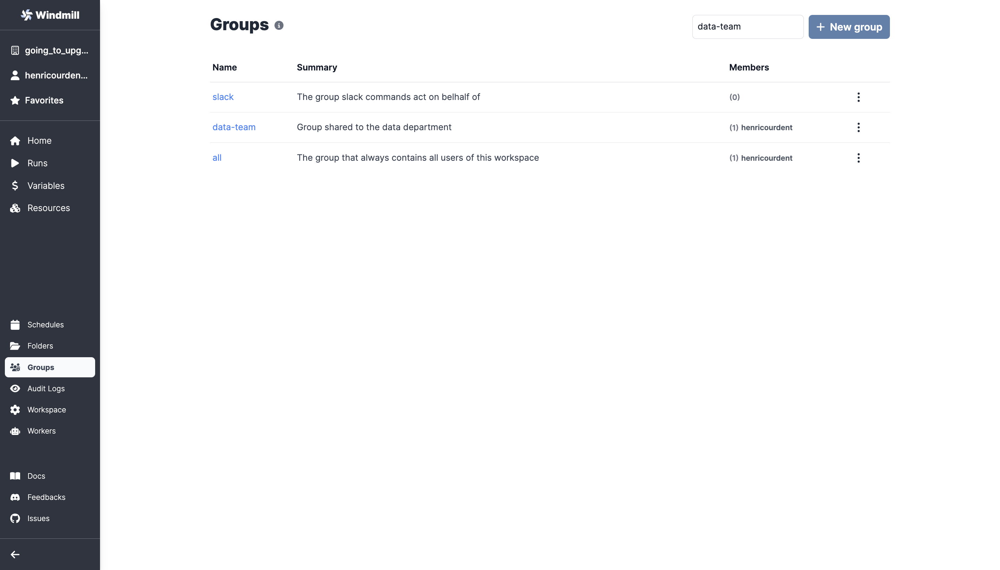
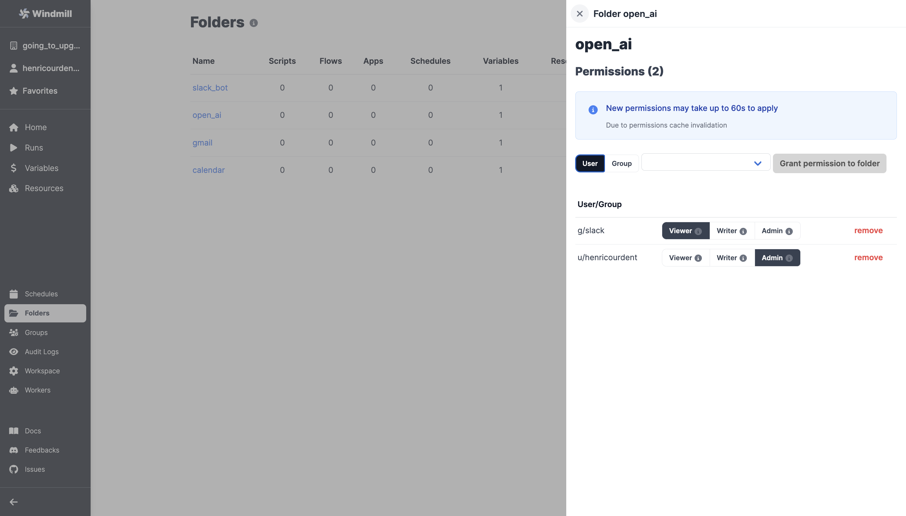

# Groups and Folders

Learn how to manage permissions and organize items using Groups and Folders in your workspace.

## Groups

Groups of users are a way to classify users together, allowing for shared permissions within the workspace. Users within the same group (also referred to as a role) will have homogenous permissions. Users can belong to multiple groups simultaneously.

Similar to users, groups can be assigned one of three permission levels for a specific item.
- Viewer: read-only access.
- Writer: read and write access.
- Admin: read and write access, and can manage permissions and new admins.

## Folders

Folders allow you to group various **items**, such as scripts, flows, resources, and schedules, together and assign Role-based access control permissions to groups and individual users.

## Groups and Folders together

Groups and folders work together to organize permissions and access control within your workspace. Groups can be included within folders, but folders cannot be nested within groups.

It means that if you want to allow a team to use a given resource, you can save it in a folder, and either add each member of the team as a user in the folder, or add a group containing the whole team to the folder.

:::tip Example of groups and folders used together

For example, you are [building a Slackbot](/blog/handler-slack-commands) and want it to use manipulate some resources. You can add the `g/slack` group (which is automatically created when you [configure Slack on Windmill](../../integrations/slack.md) to the desired resource).

 

:::