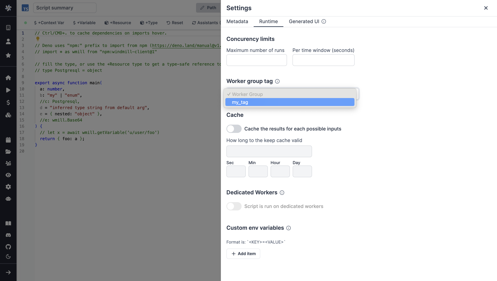

# Worker Groups

Learn how to assign custom worker groups to scripts and flows in Windmill for efficient execution on different machines with varying specifications.

This feature is useful if you want to run some scripts on a GPU machine, or if you want to run some scripts on high-memory machine.

Individual scripts saved on a workspace and inline scripts of a flow can be assigned a custom worker group. By default, they are assigned the worker group corresponding to their respective programming languages.

Workers can belong to multiple worker groups simultaneously. The default worker groups a worker is part of are:

- `dependency`: Where dependency jobs are run.
- `deno`: The default worker group for deno scripts.
- `python3`: The default worker group for python scripts.
- `bash`: The default worker group for bash scripts.
- `go`: The default worker group for go scripts.
- `flow`: The default worker group for executing flows modules outside of the script steps.
- `hub`: The default worker group for executing hub scripts.

If you assign custom worker groups to all your workers, make sure that they cover all worker groups above, otherwise those jobs will never be executed.

You can customize the worker group of a worker by setting the WORKER_TAGS environment variable.

```
WORKER_TAGS=deno,light
```

By default, the `WORKER_TAGS` of workers include `deno, python3, bash, go, flow, hub, dependency`.

The configuration above will make the workers accept only deno jobs and jobs with the `light` tag.

To make custom tags selectable from the UI, you need to pass the following env variable to the Windmill server:

```
CUSTOM_TAGS=light
```

## How to assign a custom worker group to a script

For scripts saved on the script editor, select the corresponding worker group tag in the metadata section.



For scripts inlined in the flow editor, select it in the module header:


If no worker group is assigned to a script, it will be assigned the default worker group for its language.
