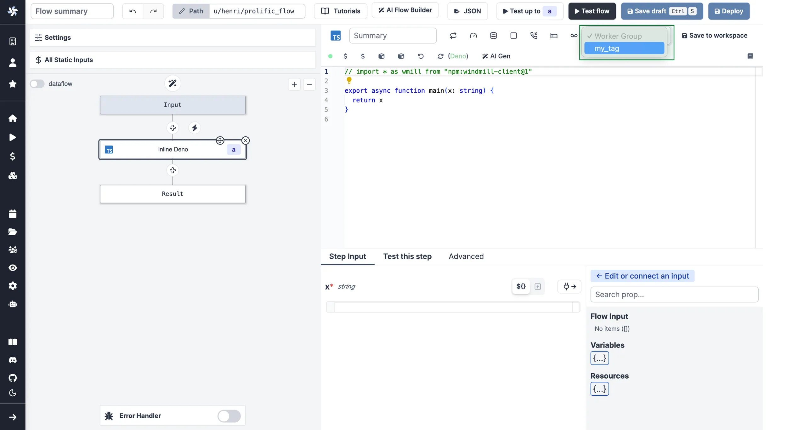

# Workers and Worker Groups

## Workers

Workers are autonomous processes that run one script at a time using the full
machines resources available to them.

Workers pull [jobs](../20_jobs/index.md) from the queue of jobs in the order of their
`scheduled_for` datetime as long as it is in the past. As soon as a worker pulls
a job, it atomically sets its state to "running", runs it, streams its logs then
once it is complete, saves it back in the database as a "complete job". The
final result and logs are stored forever.

The number of workers can be horizontally scaled up or down depending on needs
without any overhead.

Each worker on Windmill can run up to 26 millions jobs a month, where each job lasts approximatively 100ms.

## Assign custom worker groups

Assign custom worker groups to scripts and flows in Windmill for efficient execution on different machines with varying specifications.

This feature is useful if you want to run some scripts on a GPU machine, or if you want to run some scripts on high-memory machine.

Individual scripts saved on a workspace and inline scripts of a flow can be assigned a custom worker group. By default, they are assigned the worker group corresponding to their respective programming languages.

Workers can belong to multiple worker groups simultaneously. The default worker groups a worker is part of are:

- `dependency`: Where dependency jobs are run.
- `deno`: The default worker group for deno scripts.
- `python3`: The default worker group for python scripts.
- `bash`: The default worker group for bash scripts.
- `go`: The default worker group for go scripts.
- `flow`: The default worker group for executing flows modules outside of the script steps.
- `hub`: The default worker group for executing hub scripts.

If you assign custom worker groups to all your workers, make sure that they cover all worker groups above, otherwise those jobs will never be executed.

You can customize the worker group of a worker by setting the WORKER_TAGS environment variable.

```
WORKER_TAGS=deno,light,gpu
```

By default, the `WORKER_TAGS` of workers include `deno, python3, bash, go, flow, hub, dependency`.

The configuration above will make the workers accept only deno jobs and jobs with the `light` tag.

To make custom tags available from the UI and be authorized to be used, you need to pass the following env variable to the Windmill server:

```
CUSTOM_TAGS=light,gpu
```

You can restrict some tags to specific workspace using the following syntax:

```
CUSTOM_TAGS=light,gpu(workspace+workspace2)
```

Only workspace and workspace2 will be able to use the `gpu` tags.

## How to assign a custom worker group

For scripts saved on the script editor, select the corresponding worker group tag in the metadata section.


For scripts inlined in the flow editor, select it in the module header:



If no worker group is assigned to a script, it will be assigned the default worker group for its language.

You can assign a worker group to an entire flow in the flow's settings:


