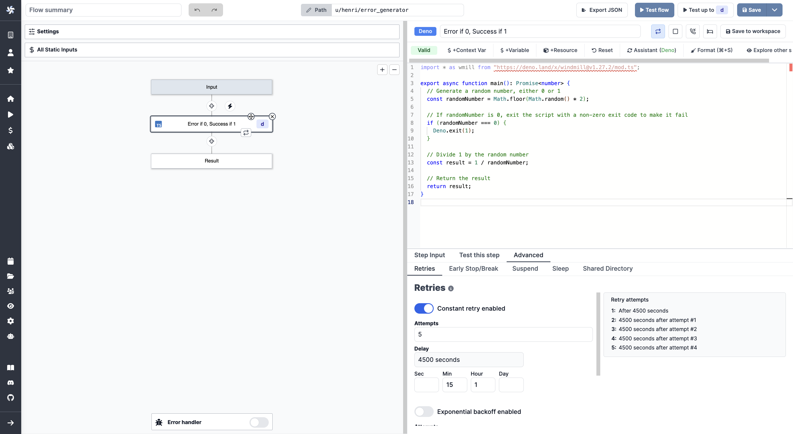
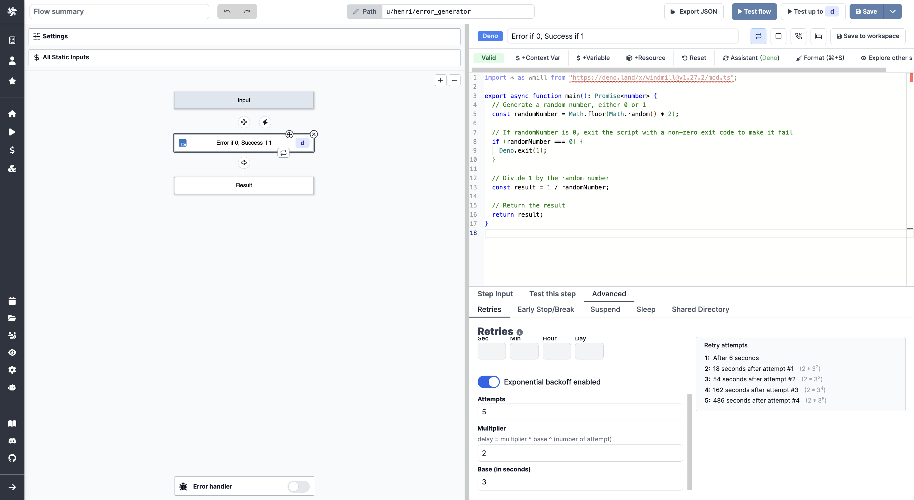

# Retries

Steps within a flow can be re-tried in case of error. This feature is useful to keep a flow trying to execute even if a step momentarily failed.

<video
    className="border-2 rounded-xl object-cover w-full h-full"
    autoPlay
    loop
    controls
    id="main-video"
    src="/videos/retries_example.mp4"
/>

 

If defined, upon error this step will be retried with a delay and a maximum number of attempts as defined below. If both static and exponential delay is defined, the static delay attempts are tried before the exponential ones.

From a single flow, this feature can for example help you with:
- **API requests**: Retry failed API calls due to temporary server issues or network timeouts every 5 minutes, for a maximum of 5 attempts, ensuring eventual data retrieval or synchronization with third-party services.
- **Payment processing**: Try again failed transactions caused by temporary issues with the payment gateway or the customer's bank for up to 3 attempts and each time clocked by longer delay (thanks to exponential backoff), reducing the likelihood of lost sales.
- **[Batch processing](/blog/stantt-case-study)**: Reattempt failed batch processing jobs caused by temporary resource constraints or server issues every 30 minutes, for a maximum of 6 attempts, ensuring that all tasks are eventually completed.

As well as many other examples (inventory synchronization, data backups, file uploads, scraping etc.)

## Constant Retries

From the `Advanced` menu, pick `Retries` and toggle `Constant retry enabled`.

From there, define a maximum number of attempts and a given delay.

Although the delay is set in seconds, inputs can be given in minutes, hours or days.

## Exponential backoff enabled

From the `Advanced` menu, pick `Retries` and toggle `Exponential backoff enabled`.

From there, define a maximum number of attempts and a given exponential delay defined by a base (in seconds), a multiplier and the number of the attempt.

The formular being given by `delay = multiplier * base ^ (number of attempt)`.

For example, for:
- base = 3
- mutliplier = 2
- attempts = 5

Here are the delays between each attempts:

|#|Delay|Formula|
|-:|:----|:------|
|1|After 6 seconds| - |
|2|18 seconds after attempt #1|2 * 3^2|
|3|54 seconds after attempt #2|2 * 3^3|
|4|162 seconds after attempt #3|2 * 3^4|
|5|486 seconds after attempt #4|2 * 3^5|
