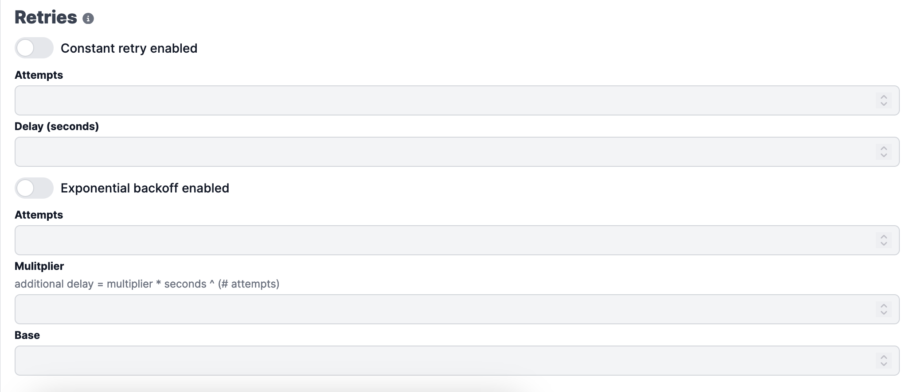

# Action editor

Windmill provide an web editor to write your scripts. It is available in the flow editor.

The script editor in split in three parts:

- [Header](#header): Edit the summary of the script, navigate to advanced configuration
- [Script editor](#script-editor): Edit the code
- [Step configuration/Test this step](#step-configurationtest-this-step): The bottom part is composed of three parts:
  - [Step input](#step-input): Define the input of the step
  - [Test this step](#test-this-step): Test the step on its own
  - [Advanced](#advanced): Advanced configuration

## Header


The header is composed of:

- **Summary**: Edit the summary of the script
- **Shortcuts**: Shortcut to advanced configuration
  1. **Retries**: Configure the number of retries and the delay between each retry
  2. **Early stop/Break**: If defined, at the end of the step, the predicate expression will be evaluated to decide if the flow should stop early. Skipped flows are just a label useful to not see them in the runs page. If stop early is run within a forloop, it will just break the for-loop and have it stop at that iteration instead of stopping the whole flow.
  3. **Suspend**: If defined, at the end of the step, the flow will be suspended until it receives external requests to be resumed or canceled. This is most useful to implement approval steps but can be used flexibly for other purpose. To get the resume urls, use `wmill.getResumeUrls()` in Typescript, or `wmill.get_resume_urls()` in Python.
  4. **Sleep**: If defined, at the end of the step, the flow will sleep for a number of seconds before scheduling the next job (if any, no effect if the step is the last one). Sleeping is passive and does not consume any resources.

## Script editor

- Context var: Add a context variable to the script
- Var: Add an input variable to the script
- Resource: Add a resource to the script
- Reset: Reset the script to its initial state
- Assistant: Reload the LSP assistant
- Format: Format the script. Can be triggerd on save (CTRL+S)
- Script: View hub or workspace script code

## Step configuration/Test this step

The step configuration is composed of three parts:

- [Step input](#step-input): Define the input of the step
- [Test this step](#test-this-step): Test the step on its own
- [Advanced](#advanced): Advanced configuration

### Step input


Inputs of a script can be defined in the step configuration. They can be configured in three ways:

- **Templatable string**: A templatable string is a string that can be templated with context variables. It is defined by wrapping the string with `${` and `}`. For example, `${context.var}` is a templatable string that will be replaced by the value of the context variable `var`.
- **Dynamic**: JS expression that will be evaluated at runtime. The expression can use context variables and input variables. For example, `context.var` is a dynamic expression that will be replaced by the value of the context variable `var`.
- **Static**: A static value that will be used as is. For example, `static value` is a static value that will be used as is.

#### Templatable string/Static

The templatable string and static value can be combined. For example, `${context.var} static value` is a templatable string that will be replaced by the value of the context variable `var` and then concatenated with the static value `static value`.

```js
`${context.var} static value`;
```

#### Dynamic

JS expression that will be evaluated at runtime.

```js
[1, 2, 3, 4].reduce((acc, val) => acc + val, 0);
```

#### Insert mode

There are two insert modes:

- **Append**: Append a context variable, a flow input or a resource at the cursor position
- **Connect**: Replace the current value by a context variable, a flow input or a resource

Clicking on a field will set the mode to "Append". Clicking on the "Connect" button will set the mode to "Connect".

### Test this step


The test this step section allows to test the step on its own. You can set the input and run the script.
The result and logs are displyed on the left-hand side.

### Advanced

The advanced section allows to configure the following:

#### Retries

Configure the number of retries and the delay between each retry



#### Early stop/Break

If defined, at the end of the step, the predicate expression will be evaluated to decide if the flow should stop early. Skipped flows are just a label useful to not see them in the runs page. If stop early is run within a forloop, it will just break the for-loop and have it stop at that iteration instead of stopping the whole flow.


#### Suspend

If defined, at the end of the step, the flow will be suspended until it receives external requests to be resumed or canceled. This is most useful to implement approval steps but can be used flexibly for other purpose. To get the resume urls, use `wmill.getResumeUrls()` in Typescript, or `wmill.get_resume_urls()` in Python.


#### Sleep

If defined, at the end of the step, the flow will sleep for a number of seconds before scheduling the next job (if any, no effect if the step is the last one). Sleeping is passive and does not consume any resources.


#### Shared Directory

See [Shared Directory](./3_flow_settings.md#shared-directory)


