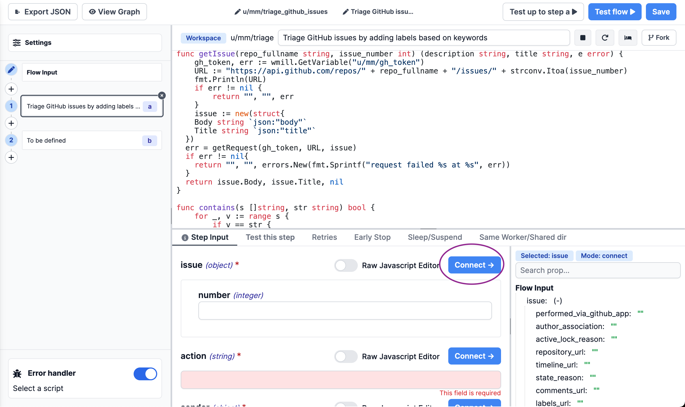
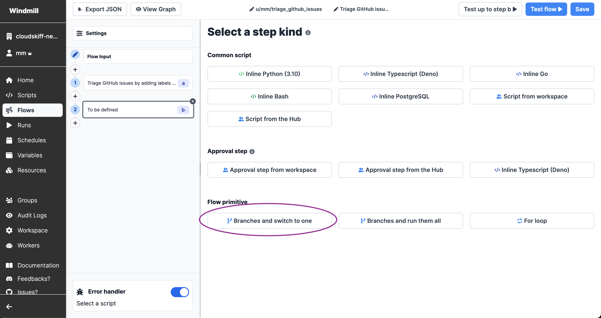
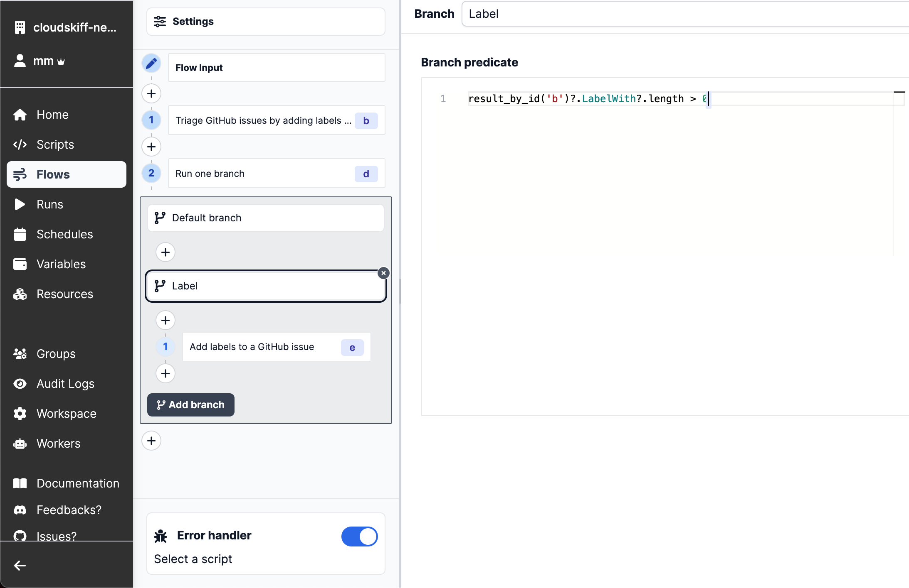
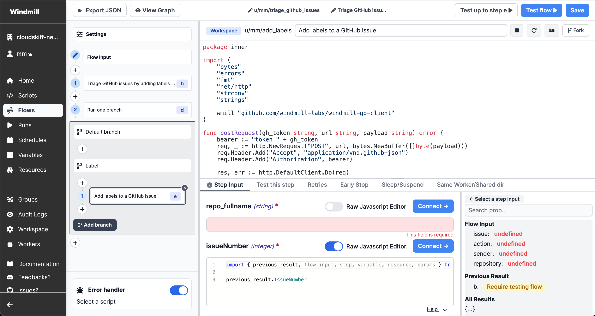

# Using Scripts, Flows and webhooks to build an issue triage bot

In this tutorial, we'll use Windmill to build a bot that automatically labels new issues created in one or more GitHub repositories.

We'll use golang, and Windmill Scripts, Flows, and webhooks. This tutorial assumes you're already familiar with the basics of Windmill, so it's recommended to complete the [golang quickstart](./quickstart_go.md) first.

## Triage bot

To build our bot, we need:
- to configure GitHub to send a webhook to Windmill when a new issue is opened
- to determine what labels should be applied
- to apply the lables to the issue

We'll build two Scripts to do this, then put it together in a flow.

## The building blocks

### A Script that labels issues

Let's start with the fastest part: let's write a script that takes in a repo name (eg. `acme-corp/myrepo`), an issue number, and a list of labels to apply, and labels the issue. This script will need to access a GitHub access token to be able to POST to GitHub's rest API. Let's call that Script `label_issues`.

This Script is available as a template in the [Hub](TODO).

```golang
package inner

import (
	"bytes"
	"errors"
	"fmt"
	"net/http"
	"strconv"
	"strings"

	wmill "github.com/windmill-labs/windmill-go-client"
)

func postRequest(gh_token string, url string, payload string) error {
	bearer := "token " + gh_token
	req, _ := http.NewRequest("POST", url, bytes.NewBuffer([]byte(payload)))
	req.Header.Add("Accept", "application/vnd.github+json")
	req.Header.Add("Authorization", bearer)

	res, err := http.DefaultClient.Do(req)

	if err != nil {
		return errors.New(fmt.Sprintf("request failed %s", err))
	}
	if !(res.StatusCode >= 200 && res.StatusCode < 300) {
		return errors.New(fmt.Sprintf("request failed %s at %s", res.Status, url))
	}
	defer res.Body.Close()
	return nil
}

func Map(l []string, f func(string) string) []string {
    lmapped := make([]string, len(l))
    for i, v := range l {
        lmapped[i] = f(v)
    }
    return lmapped
}

func addQuotes(s string) string{
  return fmt.Sprintf("\"%s\"", s)
}

func main(repo_fullname string, issueNumber int, labels []string) (interface{}, error) {
	URL := "https://api.github.com/repos/" + repo_path + "/issues/" + strconv.Itoa(issueNumber)
	// We're using the Windmill client to get the GitHub access token
	gh_token, _ := wmill.GetVariable("g/all/gh_token")

  if len(labels) == 0{
    return nil, errors.New("list of labels can't be empty")
  }

	var labelJson = fmt.Sprintf(`{"labels":[%s]}`, strings.Join(Map(labels,addQuotes)[:], ","))
	err := postRequest(gh_token, URL+"/labels", labelJson)
	if err != nil {
		fmt.Println(err)
		return nil, err
	}
	fmt.Printf("The issue was tagged with %s", labels)

	return nil, nil
}
```

The script requires the `g/all/gh_token` to be set. To do so, head to the **Variable** tab, and click Add **variable**. Variables can be labelled as Secrets, in which case they can only be read from scripts.


### A Script that gets the webhook and triages issues

Now we need a Script that receives a webhook every time an issue is created, gets the issue body and title, and decides what label to add to the issue. We'll take a basic approach: we'll have a list of keywords, and associated labels.

```golang
// Issues will be mapped to team(s) or label(s) based on keywords
var keyWordToLabel = map[string]string{
	"backend":     "team/backend",
    "logs":        "team/backend",
	"editor":        "team/frontend",
}
```

#### Setting up the webhook

Start by creating a script, called **triage_issues**. Go to the script's page, and scroll to the bottom:


Posting to this Windmill [webhook](../how-tos/1_use_webhooks.md) URL will trigger a script run. Hit create a token, and save that token somewhere. We'll need it to make sure GitHub can authentify to Windmill. Copy the webhook `path` URL as well. Let's setup GitHub to post there when an issue is created. Head to the GitHub repo you want to add the triage bot to. Go to the **Settings** then **webhooks**. Hit **add webhook**.


- Paste the Windmill webhook URL into the **Payload URL** field, and append `?token=<INSERT WINDMILL TOKEN HERE>`, substituting the Windmill token you created earlier.
- Under **Content type**, pick `application/json`. Windmill expects json payloads.
- Under **Which events would you like to trigger this webhook?**, select **Issues**

Save the webhook, and check that it's successfully posting to Windmill by going to the **Recent deliveries** tab. Check the shape of the payload: we'll need that to write our script.

Go back to Windill, and check in **Runs** that your empty script was indeed triggered by the webhook. Great! We're now receiving a payload every time there's an issue event. Now let's build our bot.

#### Writing the script

The script will return the repo name, number, and labels to apply. This will be then passed to the script we previously wrote. Let's define the return type:

```golang
type payload struct {
	Repo        string // a repo full name: owner/repo
	LabelWith   []string
	IssueNumber int
}
```

The script will receive the webhook payload as argument. So let's make sure the main function has the right signature.

```golang
func main(
	issue struct {
		Number int `json:"number"`
	},
	action string,
	sender interface{},
	repository struct {
		Full_name string `json:"full_name"`
	}) (interface{}, error) {

	labels := []string{}

	if action == "opened" {
		return payload{Repo: repository.Full_name, LabelWith: labels, IssueNumber: issue.Number}, nil
	} else {
		return "", nil
	}
}
```

This is the scaffold of the script. We The full script is available [here](https://app.windmill.dev/scripts/get/b92a261494cc63e0), we won't get into the details here.


## Putting it all together in a Flow

Now we have a script that can be triggered by a GitHub webhook, and return labels to apply. We also have a script to apply labels to issues. Let's put it all together in a Flow.

Create a **Flow** and save it as is. Go to the flow page, and copy the flow **webhook URL**. Replace that in the GitHub webhook settings page, so that new GitHub issues triggers the Flow and not the script.


Now Edit the flow.  Start with **Flow Input**:


This is where we define what inputs the script accepts. Click the **Capture from a request to seed inputs**. This will auto-populate the inputs from a previous request received by Windmill: be sure to pick one that was sent by our GitHub webhook.

Now, let's add our two Scripts as tests. Windmill supports many types of steps, but here we'll pick **Script from workflace** as we want to reuse the scripts we defined previously. Pick the script that accepts the incoming GitHub payload. You can read more about all the capabilities of Flows [here](../how-tos/5_trigger_a_flow.md).

Each step in a flow needs to be connected to the next one. For this first step, we need to connect the inputs of the Flow to the Script. You can do that in the **Step input type**. For each Script argument, pick the relevant Flow input.



Let's add our last step. If the first step finds labels to apply, we want to call our labelling Script. If there's no label to apply, we should just exit. There's a great way to do that in Windmill: **branches**. Branches are a Windmill primitive that allow to represent conditions.

Pick branches and switch to one.

. 

We'll do two things. First, defined the condition for the branch to run. You can do that by clicking on the branch, and setting a ** branch predicate**.



Second, we'll select what script to run in our branch. Pick our `label_issues` script. 



We're nearly done! We just need to connect the input of the branch to the previous step. We already know how to do that, so we won't go into details here.

#### Conclusion

And we're done! We used Scripts, Flows and Webhooks to create a bot to triage issues by applying labels. You can find the [full working Flow here](https://hub.windmill.dev/flows/27/triage-github-issues-by-adding-a-label-based-on-keywords-in-their-title-or-description).
