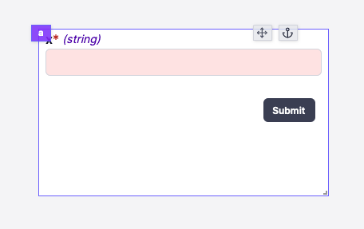

# App component library

The app component library is located on the right-hand side of the app editor. It displays the app components and allows you to configure them.

## Inserting components

Click on a component in the component library to insert it in the app canvas.

## Component list

Windmill provides a set of components that can be used to build apps. Here is the list of the available components:

### Button API

The component triggers a runnable when clicked.

#### Button Props

| Name           |                Type                 | Default  | Description                                   |
| -------------- | :---------------------------------: | :------: | --------------------------------------------- |
| label          |               string                | Press me | The button label.                             |
| color          | blue, red, dark, light, green, gray |   blue   | The button color.                             |
| size           |         xs, sm, md , lg, xl         |    sm    | The button size.                              |
| Fill container |               boolean               |  false   | Whether the button should fill the container. |
| disabled       |               boolean               |  false   | Whether the button should be disabled.        |

### Form API

The component allows you to create a form.

#### Text Input Props

| Name          |  Type  | Default | Description                          |
| ------------- | :----: | :-----: | ------------------------------------ |
| placeholder   | string |         | The text input placeholder.          |
| default value | string |         | The default value of the text input. |

- Button: A button component can be used to trigger an action.
  - Label `string`: The button label.
  - Color `string`: The button color
  - Size `string`: The button size.
  - Fill container `boolean`: Whether the button should fill the container.
  - Disabled `boolean`: Whether the button should be disabled.
- Text Input: A text input component can be used to get a string from the user.
  - Placeholder `string`: The text input placeholder.
  - Default value `string`: The default value of the text input.
- Password Input: A password input component can be used to get a password from the user.
  - Placeholder `string`: The password input placeholder.
- Number input: A number input component can be used to get a number from the user.
  - Placeholder `string`: The number input placeholder.
  - Default value `number`: The default value of the number input.
- Slider: A slider component can be used to get a number from the user.
  - Min `number`: The minimum value of the slider.
  - Max `number`: The maximum value of the slider.
- Date Input: A date input component can be used to get a date from the user.
  - Min date `string`: The minimum date of the date input.
  - Max date `string`: The maximum date of the date input.
  - Default date `string`: The default date of the date input.
- Toggle: A toggle component can be used to get a boolean from the user.
  - Label `string`: The toggle label.
  - Default value `boolean`: The default value of the toggle.
- Select: A select component can be used to get a string from the user.
  - Options `Array<{value: string; label: string}>`: The select options.
  - Item key `string`: The key of the select item.
- HTML: An HTML component can be used to display HTML content.
  - HTML `string`: The HTML content.
- Vega Lite: A Vega Lite component can be used to display a Vega Lite chart.
  - input `string`: The Vega Lite data.
  - canvas `boolean`: Whether the chart should be displayed in a canvas.
- Plotly: A Plotly component can be used to display a Plotly chart.
  - input `string`: The Plotly data.s
- Text: A text component can be used to display text.
  - input `string`: The text content.
  - style `string`: The text style.
  - Extra styles `string`: Extra styles to apply to the text. (CSS)
