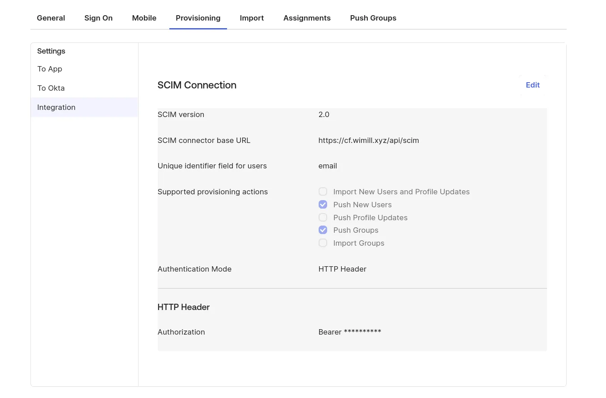
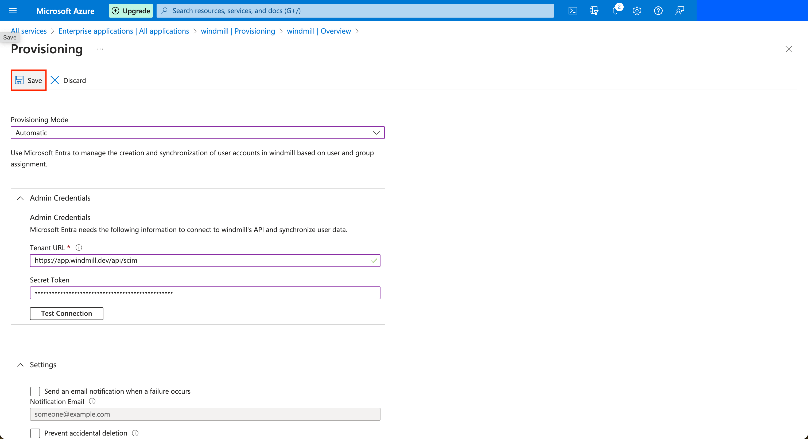

# SAML & SCIM

This guide provides guidance on configuring Okta for both SAML (Security Assertion Markup Language) and SCIM (System for Cross-domain Identity Management).

## SAML

The entity ID is `windmill`

ACS Url is `<instance_url>/api/saml/acs`
SCIM connector is `<instance_url>/api/scim`
Application username format is `Email`

Pass SAML_METADATA containing the metadata URL to the server containers to enable SAML authentication. In the helm charts, the value is `enterprise.samlMetadata`

### Okta

Configure Okta with the following settings (and replace cf.wimill.xyz with your domain):

Pass SAML_METADATA containing the metadata URL to the server containers to enable SAML authentication. In the helm charts, the value is `enterprise.samlMetadata`:

## SCIM

### Okta

Configure Okta with the following settings (and replace cf.wimill.xyz with your domain):

For the Bearer Token, use the value of `enterprise.scimToken` in the helm charts which corresponds to the `SCIM_TOKEN`` env variable for the server container.

### Microsoft Azure

In the Azure portal, go to "Enterprise Applications" and create a new one of type "Non-gallery".

Once the application is created, in the application's page go to "Provisioning" on the left menu, and click on the "Get started" button.

Choose the "Automatic" provisioning mode, and then for the Tenant URL, input the public URL of your Windmill server with the prefix `/api/scim`. For the Secret Token, use the value of `enterprise.scimToken` in the helm charts which corresponds to the `SCIM_TOKEN` env variable for the server container. You can then click on the Test Connection button to validate Azure can connect to Windmill's SCIM endpoint. You can then choose to sync only the Users and Groups assigned to this application, or all users and groups. Note that if you choose the former, after you save, go to the application's page and click on the "Users and groups" button in the left menu bar. Only the users and groups present here will be synced to Windmill.

Once this is done, you can click on the Save button at the top left. Azure will now synchronize users and groups approximately every 40 minutes.

### In Windmill

Once setup, the groups page should contain a new section:

